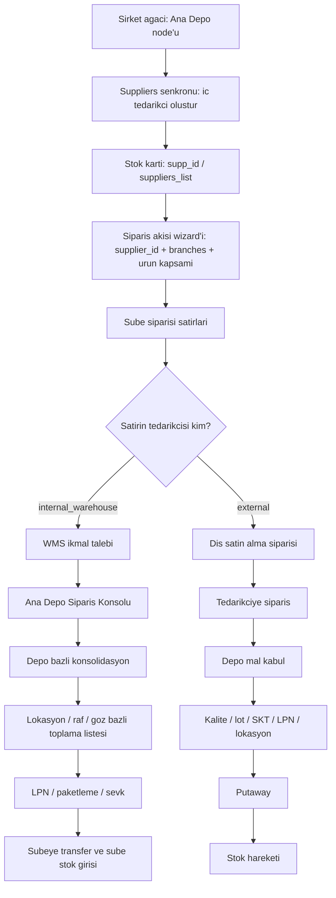
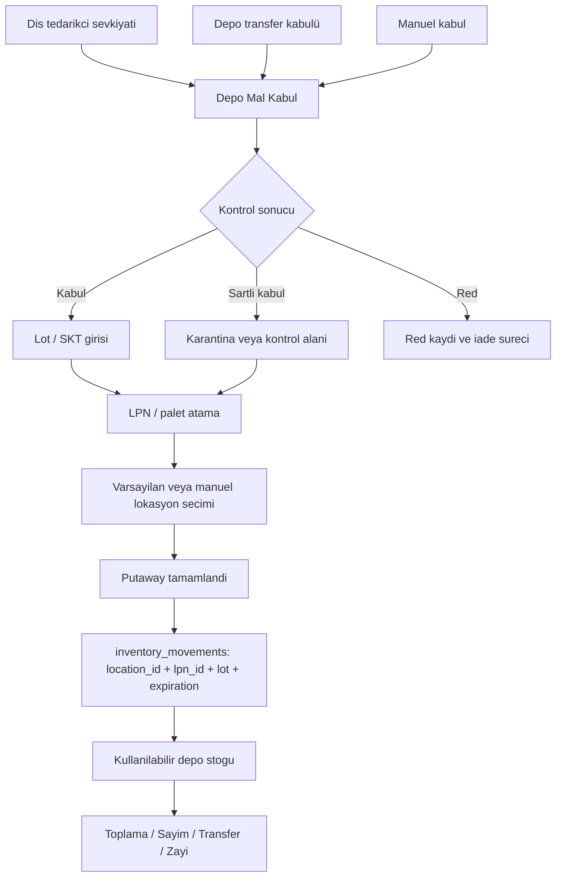
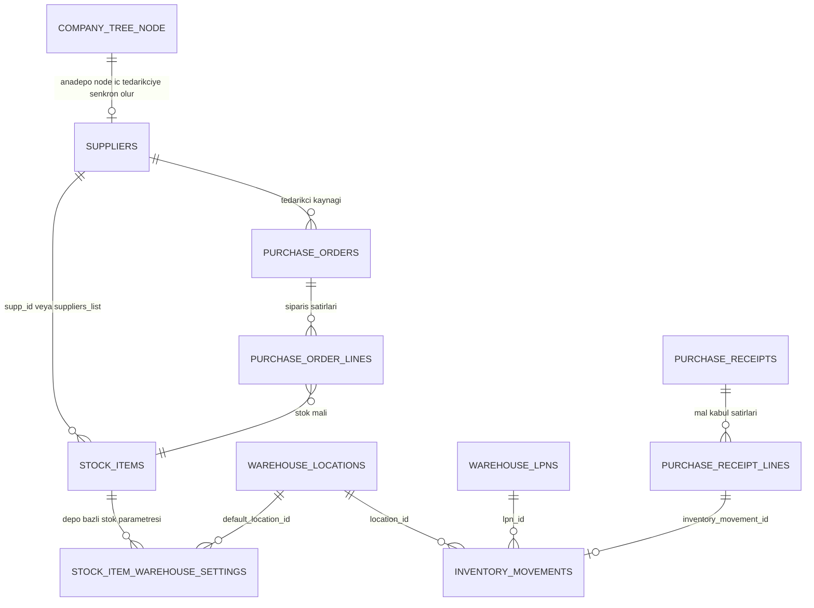
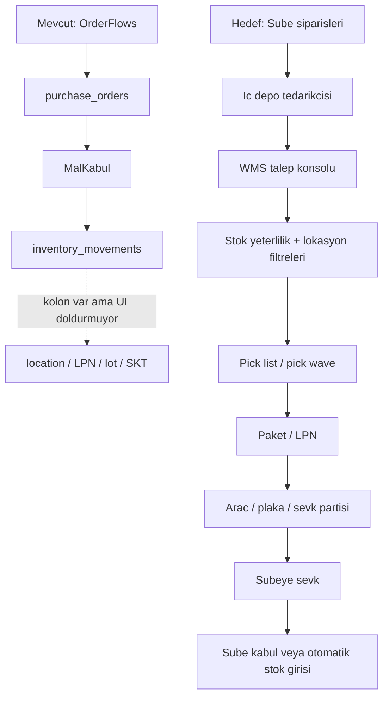

# Ana Depo / WMS Siparis Modeli Tasarim Notu

Tarih: `2026-06-08`

Bu dokuman, Ana Depo / WMS siparis modelinin nasil ilerlemesi gerektigini
netlestirmek icin hazirlandi. Mevcut incelemede `/depo-orders` ve
`/depo-mal-kabul` ekranlarinin mevcut sube `Orders` ve `MalKabul`
bilesenlerini kullandigi goruldu. Bu durum WMS iskeleti icin yeterli bir
baslangic olsa da, merkezi depo operasyonu icin ayri siparis konsolu,
konsolidasyon, toplama, paketleme ve sevk akisi gerektirir.

## Guncel Baglam / Oturum Karari

Ana Depo / WMS ekranlari tek/global calisma baglami modaliyla acilmaz.
Kullanici sidebar'daki `Ana Depo / WMS` basligindan PIN girer; personelin
yetkisi `Operasyon` ve varsayilan subesi `anadepo` tipinde ise `warehouse`
oturumu acilir.

- Oturum sekme omru boyunca `sessionStorage` icinde tutulur.
- Bolum checkbox'i sadece alt menuleri gosterir/gizler, yetki yerine gecmez.
- WMS route'unda depo oturumu yoksa sayfa icinde PIN ile giris uyarisi
  gosterilir.
- Sabit sube, ilk sube veya sabit depo gibi sessiz fallback kesinlikle yoktur.

## Ana Karar

Ana depo tek basina "sube gibi siparis veren yer" olarak ele alinmamalidir.
Ana depo, stok kartlarinda tedarikci gibi secilebilen fakat sistem tarafindan
`ic depo tedarikcisi` olarak ayrilan bir ikmal kaynagi olmalidir.

Bu nedenle:

- Sirket agacinda `anadepo` tipi bir depo tanimlandiginda, `suppliers`
  tablosunda otomatik bir ic tedarikci karsiligi olusmalidir.
- Stok kartlarinda zaten mevcut olan `stock_items.supp_id` ve
  `stock_items.suppliers_list` alanlari siparis yonlendirmesinin ana kaynagi
  olarak kullanilmalidir.
- Bir stok mali ic tedarikciye bagliysa, sube siparisi dis satin alma degil
  `depo ikmal talebi` olarak WMS konsoluna dusmelidir.
- Bir stok mali dis tedarikciye bagliysa, mevcut satin alma siparisi akisi
  calismaya devam etmelidir.

## Coklu Ana Depo Mantigi

Bir sube icin tek bir varsayilan ana depo varsayimi dogru degildir. Ayni sube
donuk urunleri baska depodan, kuru/ambalaj urunlerini baska depodan, icecekleri
ise dogrudan dis tedarikciden isteyebilir.

Ornek:

| Stok mali | Stok kartindaki tedarikci | Siparis akisi |
| --- | --- | --- |
| Patates kizartmasi | Istanbul Donuk Depo | WMS depo ikmal talebi |
| Ambalaj kutusu | Istanbul Kuru Depo | WMS depo ikmal talebi |
| Gazli icecek | Dis icecek tedarikcisi | Dis satin alma siparisi |
| Dondurulmus tavuk | Ankara Donuk Depo | WMS depo ikmal talebi |

Bu modelde yonlendirme sube basliginda degil, stok satirinda cozulur. Ayni
subeden gelen siparis satirlari farkli ic depolara veya dis tedarikcilere
bolunebilir.

## Tedarikci Siniflandirmasi

`suppliers` tablosunda ic/dış ayrimini net tutmak gerekir. Mevcut tabloda
tedarikci adi, siparis yontemi, mail/telefon ve aktiflik bilgileri var; fakat
ic depo tedarikcisi ile dis firma tedarikcisini ayiran kanonik alan yoktur.

Onerilen ek alanlar:

- `supplier_kind`: `external`, `internal_warehouse`, `internal_kitchen`
- `source_workspace_scope`: `anadepo`, `merkezmutfak` gibi kaynak baglam
- `source_branch_id`: sirket agacindaki depo/mutfak node id degeri
- `is_system_generated`: sirket agacindan otomatik olusan kayitlari ayirmak icin
- `sync_key`: tekrar tekrar ayni ic tedarikciyi olusturmamak icin stabil anahtar

Bu alanlarla "Istanbul Donuk Depo" bir tedarikci gibi secilebilir, ancak fatura,
cari borc, tedarikci maili ve dis satin alma sureclerine dis firma gibi
karistirilmaz.

## Siparis Akislari Wizard Etkisi

Mevcut `OrderFlows` wizard'i bu model icin tamamen yanlis bir yerde degildir.
Tam tersine, stok tedarikcisi uzerinden yonlendirme yapilacaksa siparis akislari
wizard'i bu yapinin kural tanim ekranina donusmelidir.

Mevcut uygun altyapi:

- Akis taniminda `supplier_id` zaten zorunludur.
- Akis taniminda siparis verebilecek noktalar `branches` alaninda tutulur.
- Urun kapsami tedarikciye gore filtrelenir; `stock_items.supp_id` ve
  `stock_items.suppliers_list` icinden secili `supplier_id` aranir.
- `sec`, `sablon`, `kontrat` ve `all` gibi urun kapsam modlari zaten vardir.
- Takvim, cut-off, teslim saati, onay ve miktar hesaplama ayarlari mevcuttur.

Bu nedenle wizard'i bastan yazmak yerine ic/dış tedarikci farkini anlayacak
sekilde genisletmek gerekir.

### Gerekli Wizard Degisiklikleri

1. `suppliers` sorgusu yalnizca `id,name` okumamalidir. `supplier_kind`,
   `source_workspace_scope`, `source_branch_id` gibi yeni alanlar da okunmalidir.
2. Tedarikci seciminde ic depo tedarikcileri badge ile ayrilmalidir:
   `Dis tedarikci`, `Ic depo`, `Merkez mutfak` gibi.
3. Secilen tedarikci `internal_warehouse` ise wizard dili degismelidir:
   - `Tedarikci` etiketi: `Ikmal Deposu`
   - `Siparis Verebilecek Subeler`: `Bu depodan siparis verebilecek noktalar`
   - `Tedarikciye iletilen siparis`: `WMS konsoluna dusen talep`
   - `Tedarikci maili gider`: bu ifade kullanilmamalidir.
4. Secilen tedarikci `external` ise mevcut satin alma dili korunabilir.
5. Wizard sonucu kullaniciya acik gosterilmelidir:
   - `Dis satin alma siparisi olusacak`
   - `WMS depo ikmal talebi olusacak`
6. Ic depo tedarikcisi secildiginde `kontrat` modu varsayilan olarak gizlenmeli
   veya pasif olmalidir. Ileride ic SLA/servis anlasmasi istenirse ayri
   tasarlanabilir.
7. `auto_send` anlami tedarikci tipine gore degismelidir:
   - Dis tedarikci: tedarikciye siparis ilet.
   - Ic depo: WMS konsolunda otomatik talep olustur veya talebi otomatik
     yayinla.
8. Onay adimlari ayni kolonlarla baslayabilir, fakat ekran dili ayrilmalidir:
   - Sube onayi
   - Genel merkez onayi
   - Ileride depo onayi veya depo planlama onayi

### Akis Turu Saklama Karari

Akis turu sadece supplier kaydindan anlik turetilirse, supplier kaydi ileride
degistiginde eski akislerin anlami kayabilir. Bu nedenle `order_flows` icine
kanonik bir akis turu alaninin eklenmesi dusunulmelidir:

- `flow_channel = external_purchase`
- `flow_channel = warehouse_replenishment`
- `flow_channel = kitchen_replenishment`

Ilk versiyonda bu alan secilen `supplier_kind` uzerinden otomatik atanabilir ve
wizard'da salt-okunur gosterilebilir. Kullaniciye ek bir karmaşık secim
verilmesine gerek yoktur.

### Coklu Depo Icin Wizard Kullanimi

Coklu ana depo senaryosunda ayri kural motoru gerekmez; her ic depo supplier
kaydina ayri akis tanimlanabilir.

Ornek akislar:

| Akis adi | Secili tedarikci | Urun kapsami | Siparis verebilecek noktalar |
| --- | --- | --- | --- |
| Donuk urun haftalik ikmal | Istanbul Donuk Depo | Donuk depo tedarikcisine bagli stoklar | Istanbul bolgesi subeleri |
| Kuru depo gunluk ikmal | Istanbul Kuru Depo | Kuru depo tedarikcisine bagli stoklar | Istanbul bolgesi subeleri |
| Ankara donuk ikmal | Ankara Donuk Depo | Ankara donuk depoya bagli stoklar | Ankara bolgesi subeleri |
| Depo dis satin alma | Dis tedarikci | Secili stoklar veya sablon | Hedef ana depo |

Buradaki kritik ayrim sudur: Sube siparis akislari ic depo supplier'ina
baglandiginda WMS talebi uretir. Ana depo dis tedarikciye siparis verecekse,
o akis dis supplier ve hedef ana depo baglamiyla tanimlanir.

## Depo Yonetimi Kapsami

Siparis akisi WMS'in sadece talep girisidir. Ana depo modelinde depo yonetimi
ayri bir operasyon katmani olarak ele alinmalidir. Bu katman hem dis
tedarikciden gelen mallari hem de subelere cikacak mallari lokasyon, LPN/palet,
lot, son kullanma tarihi ve stok hareketleriyle yonetir.

Depo yonetimi minimum su alanlari kapsamalidir:

- Depo ana verisi: ana depo node'u, ic tedarikci karsiligi, depo tipi ve aktiflik.
- Lokasyon yonetimi: bolge, koridor, raf, seviye, goz, sicaklik sinifi,
  kullanim tipi (`RESERVE`, `PICK_FACE`) ve aktif/pasif durumu.
- LPN / palet yonetimi: tekil veya toplu LPN uretimi, mevcut lokasyon, durum ve
  LPN icindeki stok hareketi baglantilari.
- Stok parametreleri: depo bazli min stok, guvenlik stogu, min/max siparis,
  siparis birimi ve varsayilan lokasyon.
- Envanter kontrolu: sayim, transfer, zayi, serbest kullanim ve duzeltme
  hareketleri.
- Giden operasyon: WMS ikmal taleplerinden toplama listesi, paketleme, sevk ve
  sube teslim/kabul akisi.
- Gelen operasyon: dis tedarikci veya transfer kaynakli mal kabul, kalite
  kontrol, lot/SKT/LPN/lokasyon girisi ve putaway.

Bu nedenle `/depo-orders` tek basina WMS demek degildir. WMS'in asil omurgasi
`warehouse_locations`, `warehouse_lpns`, `stock_item_warehouse_settings`,
`inventory_movements` ve bunlara bagli operasyon ekranlaridir.

## Mal Kabul ve Putaway Kapsami

Ana depo mal kabul ekrani sube mal kabul ekraninin depo baglamina kilitlenmis
hali olarak kalmamalidir. Depoda mal kabul, sadece "siparis geldi, stok artti"
islemi degil; gelen malın dogru alana yerlestirilmesini ve izlenebilir hale
gelmesini saglayan bir WMS giris surecidir.

Depo mal kabulde beklenen adimlar:

1. Kaynak belirleme: dis tedarikci siparisi, transfer kabulü veya manuel kabul.
2. Belge dogrulama: irsaliye, irsaliyeli fatura veya belgesiz kabul aciklamasi.
3. Satir kabulü: siparis miktari, gelen miktar, eksik/fazla/farkli urun notu.
4. Kalite/kontrol durumu: kabul, sartli kabul, karantina veya red.
5. Lot ve SKT: urun gerekiyorsa lot numarasi ve son kullanma tarihi girisi.
6. LPN/palet atama: var olan LPN'e ekleme veya yeni LPN olusturma.
7. Lokasyon atama: varsayilan lokasyon onerisi, manuel lokasyon secimi veya
   gecici kabul alani.
8. Putaway: kabul edilen malın nihai raf/göz lokasyonuna yerlestirilmesi.
9. Stok hareketi: `inventory_movements` satirlarinda `location_id`, `lpn_id`,
   `lot_number` ve `expiration_date` ile kayit.

Bu akista kalite veya lokasyon karari tamamlanmadan mal "kullanilabilir stok"
olarak gorunmemelidir. Ilk versiyonda bunun icin hareket `meta` alani veya
ileride ayri bir `availability_status`/`putaway_status` kolonu kullanilabilir.

## Ekran Ayrimi

### Sube Siparis Ekrani

Sube kullanicisi urun bazli siparis verir. Arka planda her satirin tedarikcisi
stok kartindan okunur.

- Ic depo tedarikcisi ise: satir WMS ikmal talebi olur.
- Dis tedarikci ise: satir satin alma siparisi olur.
- Bir siparis icindeki satirlar tedarikciye gore ayrilabilir.

### Ana Depo Siparis Konsolu

Ana Depo / WMS menusu altindaki `Siparisler`, sube siparis ekrani gibi
calismamalidir. Bu ekran satin alma gorevlisinin konsolidasyon ekraninin da
kopyasi olmamalidir. Satin alma gorevlisi icin ana depo, diger tedarikcilerden
farksiz bir tedarikci kaynagidir; bu nedenle genel satin alma ekraninda ana
depoya ozel farkli operasyon mantigi beklenmemelidir.

Ana Depo / WMS `Siparisler` ekrani, kendisine bagli ic depo tedarikcisi
uzerinden gelen sube taleplerini yoneten bir `ic tedarikci operasyon paneli`
gibi calismalidir. Mevcut `SupplierOrderPanel` mantigi bu ekran icin daha yakin
bir referanstir; ancak depo stok, lokasyon, LPN, toplama ve arac yukleme
katmanlariyla genisletilmelidir.

Gerekli gorunumler:

- Depoya dusen bekleyen talepler
- Sube, teslim tarihi, stok mali ve tedarikciye gore filtre
- Urun bazli konsolidasyon
- Sube kirilimi
- Stok yeterlilik kontrolu
- Varsayilan lokasyon ve toplama onceligi
- Kismi karsilama ve ikame notlari
- Urun toplam sevk plani
- Sube bazli sevk plani
- Toplamdan subelere kismi dagitim veya manuel miktar duzeltme
- Sevk partisi, arac/plaka ve yukleme durumlari

### Depo Satin Alma Siparisleri

Ana depo dis tedarikciye siparis verdiginde bu akisin satin alma gorevlisi icin
ozel bir WMS ekrani olmasi gerekmez. Ana depo da siparis veren bir nokta,
dis tedarikci de normal tedarikci olarak gorulur. Genel satin alma ekraninda
tedarikci, hedef nokta ve akis bilgisiyle yonetilebilir.

Depo baglaminda farkli olan kisim satin alma siparisinin olusturulmasi degil,
bu siparisin mal kabul ve putaway adimidir. Bu nedenle "Depo Satin Alma
Siparisleri" ihtiyaci ayri bir satin alma ekranindan cok, mevcut satin alma
akisini ana depo baglaminda dogru filtreleyen ve sonraki WMS mal kabule
baglayan bir gorunum olarak dusunulmelidir.

Bu ekranin miktar onerisi su kaynaklardan beslenmelidir:

- Subelerden gelen konsolide talepler
- Ana depo mevcut stok bakiyesi
- `stock_item_warehouse_settings` icindeki min stok, guvenlik stogu ve siparis
  birimi
- Yoldaki satin alma siparisleri
- Tedarikci min/max siparis veya koli/palet kurallari

### Depo Mal Kabul

Ana depo mal kabul ekrani sube mal kabul ekranindan ayrilmalidir. Tedarikciden
gelen mal, once ana depo stokuna girer.

Depo mal kabulde eklenmesi gereken WMS alanlari:

- Varsayilan veya zorunlu lokasyon
- LPN / palet
- Lot numarasi
- Son kullanma tarihi
- Sicaklik sinifi
- Putaway durumu

Bu ekran ayni zamanda siparis disi manuel kabul, transfer kabulü ve kismi kabul
senaryolarini da desteklemelidir. Kabul satiri hangi lokasyona ve hangi LPN'e
girdiyse, sonraki toplama ve sayim ekranlari ayni kaynaktan okumalıdır.

### Depo Operasyon Ekranlari

Ana Depo / WMS menusundeki operasyon ekranlari birlikte dusunulmalidir:

- `Lokasyonlar`: depo yerlesiminin ana adres defteri.
- `LPN / Paletler`: fiziksel tasima/birim izleme katmani.
- `Stok Parametreleri`: urun-depo bazli min stok, guvenlik stogu ve varsayilan
  lokasyon.
- `Mal Kabul`: giris, lot/SKT, LPN ve putaway baslangici.
- `Sayim`: lokasyon veya LPN bazli sayim yapabilmeli.
- `Transfer`: depo -> sube, depo -> depo veya depo ic lokasyon transferi
  ayrimlarini tasiyabilmeli.
- `Zayi Kaydi`: lokasyon/LPN/lot bazli stok dusumu yapabilmeli.
- `Serbest Kullanim Kaydi`: depodan operasyonel kullanim cikisini takip etmeli.

## Akis Cizimi

## Mal Kabul ve Depo Yonetimi Cizimi

## Veri Iliskisi Cizimi

## Uygulama Icin Fazlar

### Faz 1: Ic Tedarikci Senkronu

- Sirket agacindaki `anadepo` kayitlari `suppliers` tablosuna otomatik
  senkronlanir.
- Senkronlanan kayitlar `supplier_kind = internal_warehouse` olarak isaretlenir.
- Depo silinirse supplier kaydi silinmez; pasife alinmasi veya bagin koparilmasi
  tercih edilir. Tarihsel siparisler bozulmamalidir.

### Faz 2: Siparis Yonlendirme Ayrimi

- Siparis olusturulurken stok satirinin varsayilan tedarikcisi okunur.
- `internal_warehouse` satirlari WMS ikmal talebi olarak isaretlenir.
- `external` satirlari mevcut satin alma akisini kullanir.
- Ayni sube siparisi, tedarikciye gore birden fazla hedef akis uretebilir.

### Faz 3: Ana Depo Siparis Konsolu

- `/depo-orders` mevcut sube `Orders` ekranindan ayrilir.
- Ekran aktif `warehouse` PIN oturumundaki ana depoya dusen talepleri gosterir.
- Talep satirlari urun, sube, teslim tarihi ve stok durumuna gore konsolide
  edilir.

### Faz 4: Toplama, Paketleme ve Sevk

- Konsolide taleplerden pick list uretilir.
- `warehouse_locations` ve `stock_item_warehouse_settings.default_location_id`
  ile raf/göz yonlendirmesi yapilir.
- LPN/palet bazli paketleme ve subeye sevk kaydi olusur.
- Sevk tamamlandiginda ana depodan stok cikisi, subede stok girisi olusur.

### Faz 5: Depo Satin Alma ve Mal Kabul Ayrimi

- Ana depo dis tedarikciden alim yaparken mevcut satin alma altyapisi ana depo
  baglaminda filtrelenerek kullanilir; satin alma gorevlisi ekrani ana depoyu
  diger tedarikcilerden ayri bir WMS operasyon nesnesi gibi ele almaz.
- Depo baglaminda fark yaratan kisim satin alma siparisinden cok WMS mal kabul
  ve putaway adimidir.
- Depo mal kabulde lokasyon, LPN, lot ve son kullanma tarihi bilgileri
  operasyonel olarak zorunlu veya en azindan onerili hale getirilir.

### Faz 6: Depo Operasyon Derinlestirme

- Sayim, transfer, zayi ve serbest kullanim islemleri lokasyon/LPN/lot bazli
  hale getirilir.
- Putaway tamamlanmamis veya karantinadaki stok kullanilabilir stoktan ayrilir.
- Toplama listeleri `PICK_FACE` ve `RESERVE` lokasyon ayrimini kullanarak
  olusturulur.
- Depo raporlarinda lokasyon doluluk, yaslanan stok, SKT riski ve LPN durumu
  izlenir.

## Mevcut Yapinin Uygunluk Kontrolu

Mevcut kod ve sema, hedeflenen ana depo akisi icin bazi temel parcalari
iceriyor; ancak uctan uca depo satin alma, WMS mal kabul, sube talep
konsolidasyonu, toplama, sevk ve arac eslestirme surecini henuz tasimiyor.

Kisa karar: yapi baslangic iskeleti olarak uygun, operasyonel merkez depo
modeli icin eksik.

### 1. Deponun Kendi Dis Satin Alma Siparisi

`order_flows`, `purchase_orders` ve `purchase_order_lines` mevcut satin alma
akisini calistirabilir. Ana depo bir sube/node gibi hedeflenirse dis tedarikciye
siparis olusturmak teknik olarak mumkundur.

Eksik kisim, bu akisin "depo kendi ihtiyaci icin dis satin alma" oldugunu
kanonik olarak ayiran alanlardir. `order_flows` icinde `flow_channel`,
`purchase_orders` icinde hedef depo/kanal/operasyon tipi gibi ayrimlar yoktur.
Bu yuzden bugun ayni tablo akisi kullanilsa bile ekran dili ve operasyon
anlami sube satin alma mantigina cok yakindir.

### 2. Depo Mal Kabul ve Lokasyon Isleme

Sema tarafinda WMS icin onemli kolonlar vardir:

- `inventory_movements.location_id`
- `inventory_movements.lpn_id`
- `inventory_movements.lot_number`
- `inventory_movements.expiration_date`
- `warehouse_locations`
- `warehouse_lpns`
- `stock_item_warehouse_settings.default_location_id`

Fakat mevcut `MalKabul.jsx` kayit akisi bu alanlari doldurmuyor. Mal kabul
satirlari `purchase_receipt_lines` icine temel miktar/fiyat bilgisiyle yaziliyor,
sonra `inventory_movements` satiri olusturuluyor; bu satirda lokasyon, LPN, lot
ve SKT bilgisi yok. Ekran basligi ve secim dili de halen sube baglaminda:
`Mal Kabul`, `Sube secin`, sube secici.

Bu nedenle bugunku mal kabul ekrani ana depo icin yeterli degil. Depoda mal
kabul sirasinda en azindan kabul alani veya nihai raf/goz lokasyonu islenmeli.
Ilk versiyon icin zorunlu minimum:

- hedef lokasyon veya gecici kabul lokasyonu
- opsiyonel/zorunlu LPN
- lot numarasi
- son kullanma tarihi
- kabul, karantina, red veya putaway bekliyor durumu

### 3. Subelerden Gelen Ic Depo Siparisleri

Subeler, siparis akislarinda tedarikci olarak ic depo supplier'ini secerse
mevcut `purchase_orders` tablosu uzerinden siparis satiri uretmek mumkun
gorunur. Ancak sistemde henuz `internal_warehouse` tedarikci ayrimi,
`warehouse_replenishment` akis kanali veya "bu siparis WMS konsoluna dusmeli"
diyen net bir model yoktur.

Bu nedenle 50 subeden gelen talepler bugun WMS talebi gibi degil, tedarikciye
giden satin alma siparisleri gibi davranma riski tasir.

### 4. Konsolidasyon ve Stok Yeterlilik

`PurchasingManager.jsx` ve `SupplierOrderPanel.jsx` icinde konsolidasyon
gorunumleri vardir. Bunlar siparisleri sube/tedarikci/stok kiriliminda toplamak
icin yararli bir baslangic saglar.

Bu noktada ekran sorumlulugu ayrilmalidir:

- `PurchasingManager`: Satin alma gorevlisi icin ana depo dahil tum
  tedarikcileri ayni mantikla gosterir. Ana depo burada ozel WMS operasyonu
  degil, tedarikci gibi gorunen ikmal kaynagidir.
- `Ana Depo / WMS Siparisler`: Ic depo supplier'ina gelen siparisleri tedarikci
  paneli mantigiyla yonetir; urun toplam, sube kirilimi, stok yeterlilik,
  lokasyon bazli toplama ve sevk buradan yapilir.
- `SupplierOrderPanel`: Dis tedarikci perspektifi icin mevcut mantik referans
  alinabilir; ic depo paneli bunun WMS genisletilmis versiyonu olmalidir.

Fakat WMS icin gerekenler daha farklidir:

- talep edilen miktar ile depodaki kullanilabilir stok karsilastirmasi
- stok yeterli/yetersiz/karantina/putaway bekliyor ayrimi
- lokasyon, raf, goz, sicaklik sinifi, LPN ve SKT bazli filtre
- hangi raftan ne kadar toplanacak sorusunun cevabi
- kismi karsilama ve eksik sevk karari
- toplama listesi veya pick wave olusturma

Mevcut konsolidasyon bu seviyede degil; miktar/tutar odakli satin alma
konsolidasyonu olarak duruyor.

### 5. Toplama, Sevk ve Sube Teslimi

Mevcut `SupplierOrderPanel.jsx` icindeki "Sevk Et" islevi tedarikcinin siparisi
gonderdigini meta alanina isleyen bir sevk bildirimi gibi calisiyor. Depodaki
stoktan toplama, ana depo stok cikisi, sube hedefi, paket/LPN, kismi sevk,
yukleme ve sube kabul adimlarini baglamiyor.

Hedef modelde urun toplam ve sevk islemleri Ana Depo / WMS `Siparisler`
ekranindan yonetilmelidir. Depocu once urun toplam talebi gorur, sonra bu toplam
talebi sube kirilimina, stok yeterliligine, lokasyon/raf siralamasina ve arac
yukleme planina gore sevk edilecek miktarlara donusturur.

Bu ekranda beklenen temel islemler:

- Urun toplam konsolidasyon: 50 subenin toplam talebi.
- Urun -> sube dagilimi: her urunun hangi subeye ne kadar gidecegi.
- Sube -> urun dagilimi: tek subenin sevk paketi.
- Eksik stok karari: tam, kismi, beklet, iptal, ikame veya manuel miktar.
- Raf/lokasyon filtresi: belirli raf/gozden toplanacak urunler.
- Sevk partisi: bir veya daha fazla sube siparisini ayni yuklemeye alma.
- Arac/plaka atama: sevk partisinin hangi araca yuklenecegi.
- Sevk onayi: ana depo stok cikisi ve subeye giden hareketin olusmasi.

`InventoryTransfer.jsx` depo/sube transferi icin kullanilabilecek bir parca
saglar; fakat siparis talepleri, konsolidasyon, toplama ve arac yukleme akisi
ile entegre degildir.

### 6. Arac / Plaka / Yukleme

Mevcut sema ve ekranda arac, plaka, kamyon, sevk partisi veya teslimat turu
modeli bulunmuyor. Bu nedenle "su siparis su plakali kamyona yuklendi" bilgisi
bugun kanonik olarak tutulamaz.

Gereken yeni model ornegi:

- `warehouse_shipments` veya `shipment_batches`
- `warehouse_shipment_orders`
- `warehouse_shipment_lines`
- `vehicles`
- `drivers` veya serbest sofor bilgisi
- plaka, rota, yukleme zamani, cikis zamani, durum

Fatura/entegrasyon daha sonra gelebilir; fakat arac/plaka atamasi fatura
entegrasyonundan bagimsiz bir WMS sevk modeli olarak erkenden tasarlanmalidir.

### Mevcut ve Hedef Akis Karsilastirmasi

## Bu Kontrolden Cikan Tasarim Karari

Mevcut ekranlari sadece isim degistirerek ana depo ekrani yapmak yeterli
olmaz. Dogru ayrim su olmalidir:

- Depo dis satin alma: mevcut satin alma altyapisi genisletilerek kullanilabilir.
- Satin alma gorevlisi ekrani: ana depoyu ozel WMS nesnesi gibi degil,
  tedarikci gibi gosterir; burada ana depoya ozel sevk/toplama operasyonu
  beklenmez.
- Depo mal kabul: mevcut mal kabul ekranindan ayrilmali veya WMS modu almali;
  lokasyon/LPN/lot/SKT yazmadan tamamlanmamali.
- Sube -> ic depo siparisi: mevcut siparis akisi tetikleyici olabilir, fakat
  sonuc `purchase_orders` gibi degil WMS talep/fulfillment modeli gibi
  davranmali.
- Ana depo konsolu: yeni ekran gerekir; tedarikci paneli karakterinde calismali,
  talep konsolidasyonu, urun toplam sevk, stok yeterlilik, lokasyon bazli
  toplama, kismi dagitim ve sevk kararlarini tek yerden yonetmelidir.
- Arac/plaka: yeni sevk partisi ve arac modeli gerekir.

## Acik Kararlar

- `suppliers` icindeki ic tedarikci kayitlari kullanici tarafindan duzenlenebilir
  mi, yoksa sadece sirket agacindan mi yonetilir?
- Stok kartinda birden fazla ic depo tedarikcisi varsa varsayilan secim mi
  kullanilacak, yoksa teslim bolgesi/tarihine gore otomatik secim mi yapilacak?
- WMS ikmal talepleri mevcut `purchase_orders` tablosunda mi ayrilacak, yoksa
  ayri `warehouse_requisitions` tablosu mu kurulacak?
- Sevk sonrasi sube kabul adimi zorunlu mu olacak, yoksa sevk ile otomatik sube
  stok girisi yeterli mi sayilacak?
- Karantina, sartli kabul ve putaway bekleyen stoklar mevcut `inventory_movements`
  meta alaninda mi tutulacak, yoksa ayri durum kolonlari mi eklenecek?
- Depo ici lokasyon transferleri mevcut transfer ekraniyla mi, yoksa WMS'e ozel
  daha hafif bir lokasyon tasima ekraniyla mi yapilacak?

## Sonuc

Hazir altyapi tamamen yanlis degil: stok kartinda tedarikci secimi, coklu
tedarikci listesi, depo bazli stok parametreleri, lokasyon ve LPN tablolari
mevcut. Eksik olan kisim, bu parcalari "ic depo tedarikcisi" ve "WMS ikmal
talebi" kavramlariyla birbirine baglayan operasyon akisi ve ekran ayrimidir.
