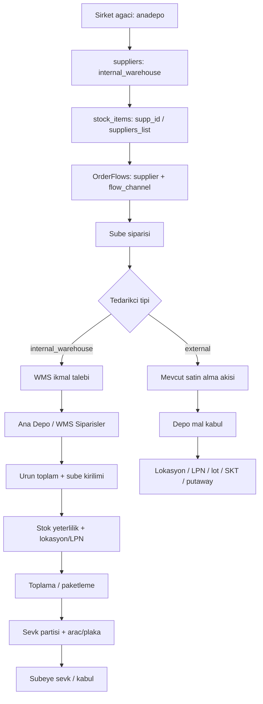

# Ana Depo / WMS Agent Talimatlari

Tarih: `2026-06-08`

Bu dokuman, `docs/ana_depo_siparis_modeli.md` tasarim notunu uygulama
fazlarina bolen agent talimatidir. Her agent kendi fazinda kucuk ve kanitli
ilerlemeli; once mevcut kodu okumali, sonra en dar kapsamli degisikligi yapmali,
sonunda dogrulama ve devir notu birakmalidir.

## Kanonik Kaynaklar

Her agent ise baslamadan once su dosyalari okumalidir:

1. `.antigravityrules.md`
2. `SUITABLERMS_PROJECT_GOVERNANCE.md`
3. `OperationSync.md`
4. `docs/ana_depo_siparis_modeli.md`
5. `docs/ana_depo_wms_agent_talimatlari.md`

Uygulama kural seti:

- Railway Postgres tek kaynak kabul edilir.
- Supabase/AWS/local fake DB yaklasimi eklenmez.
- Operasyonel veri `localStorage`, `sessionStorage`, IndexedDB veya browser
  cache'e tasinmaz.
- PIN/workspace baglami disinda yeni auth kurgusu eklenmez.
- Ilgili is bittiginde `OperationSync.md` guncellenir.
- Buyuk refactor yerine fazin gerektirdigi en kucuk guvenli degisiklik yapilir.

## Degismez Mimari Kararlar

- Ana depo, satin alma gorevlisi icin herhangi bir tedarikcidir.
- `PurchasingManager` WMS toplama/sevk ekranina cevrilmez.
- Ana Depo / WMS `Siparisler` ekrani ic tedarikci operasyon paneli gibi
  tasarlanir.
- `SupplierOrderPanel` mantigi WMS siparis ekrani icin referanstir; fakat WMS
  ekraninda stok yeterlilik, lokasyon, LPN, toplama, kismi sevk, sevk partisi
  ve arac/plaka bulunmalidir.
- Sube siparis akislari ic depo supplier'ina baglandiginda WMS ikmal talebi
  uretmelidir.
- Ana depo dis tedarikciden alim yaptiginda mevcut satin alma altyapisi
  kullanilabilir; fark mal kabul ve putaway adimindadir.
- Fatura entegrasyonu bu fazlarin konusu degildir.

## Hedef Akis

## Faz 0: Kesif ve Karar Netlestirme

Amac: Kodun mevcut davranisini bozmadan uygulanacak veri modeli kararini
netlestirmek.

Okunacak dosyalar:

- `schema-railway-master.sql`
- `src/components/pages/Suppliers.jsx`
- `src/components/pages/StockItems.jsx`
- `src/components/pages/OrderFlows.jsx`
- `src/components/pages/Orders.jsx`
- `src/components/pages/MalKabul.jsx`
- `src/components/pages/SupplierOrderPanel.jsx`
- `src/components/pages/PurchasingManager.jsx`
- `src/components/pages/InventoryTransfer.jsx`
- `src/components/pages/WmsLocations.jsx`
- `src/components/pages/WmsLpns.jsx`
- `src/components/pages/WmsStockParams.jsx`

Karar verilecek konular:

- WMS ikmal talebi mevcut `purchase_orders` uzerinde kanal/status alanlariyla mi
  ayrilacak, yoksa `warehouse_requisitions` gibi ayri tablo mu acilacak?
- Putaway/karantina/kullanilabilir stok ayrimi ilk versiyonda `meta` ile mi,
  yoksa kolonlarla mi baslatilacak?
- Sube kabul adimi zorunlu mu olacak, yoksa sevk ile otomatik stok girisi mi
  yapilacak?

Cikti:

- Kisa karar notu.
- Etkilenen tablo ve ekran listesi.
- Risk ve geri donus plani.

Kabul kriteri:

- Karar `docs/ana_depo_siparis_modeli.md` ile celismez.
- Satin alma ekranini WMS ekranina ceviren bir plan cikmaz.
- `OperationSync.md` devir kaydi guncellenir.

## Faz 1: Ic Tedarikci Veri Modeli ve Senkron

Amac: Sirket agacindaki ana depo node'larini `suppliers` icinde ic tedarikci
olarak kanonik hale getirmek.

Beklenen veri modeli:

- `suppliers.supplier_kind`: `external`, `internal_warehouse`,
  `internal_kitchen`
- `suppliers.source_workspace_scope`
- `suppliers.source_branch_id`
- `suppliers.is_system_generated`
- `suppliers.sync_key`

Agent talimati:

- Mevcut `suppliers` kullanimlarini okuyup geriye uyumlu kolon ekle.
- Mevcut dis tedarikcileri varsayilan `external` kabul et.
- `anadepo` node'u olustugunda veya guncellendiginde supplier karsiligini
  upsert eden tekil, tekrar calistirilabilir mekanizma tasarla.
- Ana depo silinirse tarihsel siparisleri bozma; supplier kaydini silmek yerine
  pasife alma veya bagini koparma davranisini tercih et.

Teslimatlar:

- SQL/migration veya schema guncellemesi.
- Senkron helper veya ilgili UI/service entegrasyonu.
- Supplier ekraninda ic tedarikci kayitlarinin ayirt edilebilir hali.

Kabul kriterleri:

- Ayni ana depo icin tekrar tekrar supplier olusmaz.
- Mevcut dis tedarikci siparisleri bozulmaz.
- Stok kartinda ic depo supplier'i secilebilir.

## Faz 2: Siparis Akislari Wizard Ayrimi

Amac: `OrderFlows` wizard'inin ic depo ve dis tedarikci farkini anlamasi.

Agent talimati:

- `OrderFlows.jsx` icinde supplier sorgusunu `supplier_kind` ve kaynak alanlari
  okuyacak sekilde genislet.
- Tedarikci seciminde badge/etiket kullan:
  - `Dis tedarikci`
  - `Ic depo`
  - `Merkez mutfak`
- Ic depo secildiginde ekran dilini degistir:
  - `Tedarikci` yerine `Ikmal Deposu`
  - `Tedarikciye iletilen siparis` yerine `WMS konsoluna dusen talep`
- `order_flows.flow_channel` veya karar verilen alternatif alan ile akis
  turunu stabilize et.
- Eski akislar icin geriye uyumlu varsayim uygula.

Teslimatlar:

- Wizard UI guncellemesi.
- Flow kayit modeli guncellemesi.
- Eski flow kayitlari icin migration/backfill.

Kabul kriterleri:

- Dis tedarikci akislarinda mevcut davranis korunur.
- Ic depo flow'u acikca WMS ikmal talebi olarak gorunur.
- Kullaniciya gereksiz ek karmasik secim verilmez; kanal supplier tipinden
  turetilir veya salt-okunur gosterilir.

## Faz 3: Sube Siparisinden WMS Talebe Yonlendirme

Amac: Sube siparis satirlarini stok kartindaki tedarikciye gore ayirmak.

Agent talimati:

- `Orders.jsx` ve ilgili `branchPurchasing` helper'larini oku.
- Satir tedarikcisini `stock_items.supp_id` ve `stock_items.suppliers_list`
  uzerinden coz.
- `external` tedarikci satirlarini mevcut satin alma akisiyle birak.
- `internal_warehouse` satirlarini karar verilen WMS talep modeline yonlendir.
- Ayni sube siparisinde farkli tedarikcilere giden satirlarin bolunmesini
  destekle.

Teslimatlar:

- WMS talep olusturma yolu.
- Siparis detayi ve durum dilinde ic depo ayrimi.
- Geriye uyumlu kayit okuma.

Kabul kriterleri:

- Donuk/kuru/icecek gibi farkli tedarikciler ayni subeden dogru hedeflere
  ayrilir.
- Dis satin alma akisi regresyon yemez.
- WMS talebi hangi ana depoya dustugunu kanonik olarak bilir.

## Faz 4: Depo Mal Kabul ve Putaway

Amac: Depo mal kabulde lokasyon, LPN, lot, SKT ve putaway bilgisini operasyonel
hale getirmek.

Agent talimati:

- `MalKabul.jsx` mevcut sube baglaminda korunacak mi, yoksa WMS modu/ayri ekran
  mi yapilacak kararini Faz 0 kararina gore uygula.
- Depo baglaminda en az su alanlari topla:
  - lokasyon veya gecici kabul alani
  - LPN/palet
  - lot numarasi
  - son kullanma tarihi
  - kalite/karantina/putaway durumu
- `inventory_movements.location_id`, `lpn_id`, `lot_number`,
  `expiration_date` alanlarini doldur.
- Putaway tamamlanmamis veya karantinadaki stogu kullanilabilir stoktan ayir.

Teslimatlar:

- WMS mal kabul UI akisi.
- Stok hareketi yaziminda WMS alanlari.
- Kismi kabul, fazla/eksik kabul ve manuel kabul davranisi.

Kabul kriterleri:

- Mal kabul satiri lokasyonsuz tamamlanamaz veya kabul alani gibi kontrollu
  varsayilanla tamamlanir.
- Sonraki stok bakiyesi lokasyon/LPN bazli izlenebilir.
- Sube mal kabul davranisi bozulmaz.

## Faz 5: Ana Depo / WMS Siparisler Paneli

Amac: Ic depo supplier'ina gelen sube taleplerini tedarikci paneli karakterinde
yoneten ana operasyon ekranini kurmak.

Agent talimati:

- `PurchasingManager` kopyalanip WMS'e cevrilmez.
- `SupplierOrderPanel` davranisi referans alinir, ancak WMS ekranina ozel veri
  modeli kullanilir.
- Ekran aktif ana depo baglamina gore calisir.
- Gerekli gorunumleri sagla:
  - depoya dusen bekleyen talepler
  - urun toplam konsolidasyon
  - urun -> sube dagilimi
  - sube -> urun dagilimi
  - stok yeterli/yetersiz
  - lokasyon/raf/goz/LPN/SKT filtreleri
  - kismi karsilama ve manuel miktar duzeltme

Teslimatlar:

- `/depo-orders` icin WMS'e ozel ekran.
- Konsolidasyon ve stok yeterlilik hesaplari.
- Kullaniciya depocu diliyle durumlar.

Kabul kriterleri:

- 50 subenin talepleri urun toplam ve sube kiriliminda gorulebilir.
- Ana depo stok yeterliligi ayni ekranda gorunur.
- Raf/lokasyon filtresi toplama kararini etkiler.
- Satin alma gorevlisi ekrani tedarikci agnostik kalir.

## Faz 6: Toplama, Paketleme, Sevk ve Arac/Plaka

Amac: WMS talebini fiziksel sevke donusturmek.

Beklenen model:

- `warehouse_shipments` veya `shipment_batches`
- `warehouse_shipment_orders`
- `warehouse_shipment_lines`
- `vehicles`
- opsiyonel `drivers` veya serbest sofor bilgisi

Agent talimati:

- Sevk partisi birden fazla sube siparisini kapsayabilmeli.
- Her sevk partisine plaka/arac atanabilmeli.
- Kismi sevk desteklenmeli.
- Sevk onayi ana depo stok cikisini olusturmali.
- Sube kabul veya otomatik stok girisi karari Faz 0 kararina gore uygulanmali.
- Fatura/entegrasyon bu faza eklenmemeli.

Teslimatlar:

- Sevk partisi modeli.
- Arac/plaka atama UI'i.
- Sevk onayi ve stok hareketleri.
- Gerekirse sube teslim/kabul bekleme durumu.

Kabul kriterleri:

- "Su siparis su plakali araca yuklendi" bilgisi kalici ve sorgulanabilir olur.
- Tam ve kismi sevk ayrilir.
- Stok cikisi sevk onayi olmadan kesinlesmez.

## Faz 7: Depo Operasyon Derinlestirme

Amac: Sayim, transfer, zayi ve serbest kullanim islemlerini lokasyon/LPN/lot
bazli hale getirmek.

Agent talimati:

- `Count.jsx`, `InventoryTransfer.jsx`, `InventoryOperationRecord.jsx` ve WMS
  master ekranlarini oku.
- Stok dusen veya artan her depo operasyonunda lokasyon/LPN/lot etkisini
  degerlendir.
- Depo ici lokasyon transferi ile depo -> sube transferini birbirine
  karistirma.

Teslimatlar:

- Lokasyon/LPN bazli sayim.
- Lokasyon/LPN bazli zayi ve serbest kullanim.
- Depo ici lokasyon tasima veya transfer akisi.

Kabul kriterleri:

- Bir raf veya LPN icin stok raporu alinabilir.
- Lokasyon degisikligi stok miktarini degistirmez; sadece adresini degistirir.
- Zayi/kullanim hareketleri dogru lokasyon/LPN/lot kaynagini azaltir.

## Faz 8: Uctan Uca Kontrol ve Kabul

Amac: Tum fazlarin tek operasyon senaryosunda birlikte calistigini kanitlamak.

Kontrol senaryosu:

1. Sirket agacinda `Istanbul Donuk Depo` ana depo olarak tanimlanir.
2. Sistem bunu `internal_warehouse` supplier olarak senkronlar.
3. Patates kizartmasi stok kartinda bu supplier'a baglanir.
4. Kadikoy ve Besiktas subeleri ayni siparis akisindan urun ister.
5. Talepler Ana Depo / WMS `Siparisler` ekranina duser.
6. Ekran urun toplam ve sube kirilimini gosterir.
7. Depo mevcut stok ve lokasyon yeterliligi kontrol edilir.
8. Toplama listesi lokasyon/raf sirasi ile olusur.
9. Kismi veya tam sevk karari verilir.
10. Sevk partisi plaka/arac ile eslestirilir.
11. Sevk onayi ana depo stok cikisini olusturur.
12. Sube kabul veya otomatik stok girisi karara gore tamamlanir.

Kabul kriterleri:

- Her stok hareketi Railway DB'de izlenebilir.
- Ana depo, satin alma ekraninda tedarikci gibi gorunur.
- WMS operasyonu Ana Depo / WMS ekranindan yonetilir.
- Mal kabul lokasyon/LPN/lot/SKT bilgisini kaybedecek sekilde tamamlanmaz.
- Arac/plaka bilgisi shipment kaydinda kalici olur.

## Her Agent Icin Bitis Kontrol Listesi

Her faz sonunda agent su kontrol listesini tamamlamadan final vermemelidir:

- Degisiklik sadece faz kapsamina mi ait?
- `docs/ana_depo_siparis_modeli.md` ile celisen karar var mi?
- Satin alma ekranina WMS'e ozel toplama/sevk sorumlulugu tasindi mi?
- Operasyonel veri local/browser storage'a tasindi mi?
- Gerekli DB alanlari schema/migration tarafinda var mi?
- Eski dis tedarikci satin alma akisi korunuyor mu?
- Mal kabul veya stok hareketi lokasyon/LPN/lot bilgisini kaybediyor mu?
- Arac/plaka/fatura gibi kapsami ayrilan isler yanlis faza cekildi mi?
- Ilgili test/build/smoke calistirildi mi veya neden calistirilamadigi yazildi mi?
- `OperationSync.md` guncellendi mi?

## Final Reviewer Kontrolu

Bu dokumani izleyen son kontrol agent'i su denetimi yapmalidir:

- Fazlar sirali ve birbirine bagimli mi?
- Bir faz baska fazin veri modelini varsayip yazmadan ilerliyor mu?
- `PurchasingManager` ve WMS `Siparisler` sorumluluklari karismis mi?
- `SupplierOrderPanel` referansi dogru kullanilmis mi, yoksa meta tabanli sevk
  bildirimi WMS sevk modeli zannedilmis mi?
- Mal kabul, putaway ve lokasyon/LPN kararlari siparis akisi kadar net mi?
- Fatura entegrasyonu yanlislikla kapsam icine alinmis mi?

Kontrol sonucu `OperationSync.md` icine "kontrol edildi" notu olarak
eklenmelidir.
