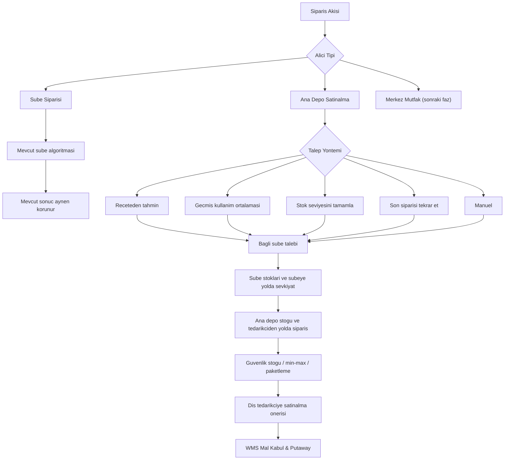

# WMS Faz 8: Ana Depo Talep Tahmini ve Satinalma Planlama Motoru

## Amaç

Ana Depo'nun kendi stok ihtiyaci icin dis tedarikciye verecegi satinalma siparislerinde, sadece mevcut stok seviyesine bakmakla kalmayip, bagli subelerin beklenen talebini de hesaba katan ayri bir planlama motoru kurmak.

Bu is, mevcut sube siparis algoritmasini bozmadan yapilacak. Sube siparisleri mevcut davranisini koruyacak; Ana Depo talep tahmini ayri bir motor olarak eklenecek.

## Ana Ilke

Mevcut sube siparis algoritmasi kesinlikle bozulmayacak.

Sube siparisleri icin mevcut davranis korunur:

- `/orders`
- mevcut `Orders.jsx`
- mevcut `createDraftLines`
- mevcut satis tahmini / recete / stok tamamlama / son siparis / manuel davranislari

Ana Depo icin yeni davranis bu akisin yanina eklenir; mevcut sube hesaplari degistirilmez.

## Temel Kavram

Sube satis yapar ve satis tahmininden siparis onerisi uretir.

Ana Depo satis yapmaz; Ana Depo bagli subelerin gelecek talebini, kendi stoklarini, yoldaki siparisleri ve depo parametrelerini birlikte hesaplayarak dis tedarikciye satinalma siparisi onerir.

Ana Depo tahmini su soruya cevap vermelidir:

```text
Bu ana depodan beslenen subelerin onumuzdeki planlama doneminde hangi stok malindan ne kadar ihtiyaci olacak ve ana depo dis tedarikciden ne kadar almali?
```

## Dogru Ana Depo Formulu

Ornek: Hamburger ekmegi.

```text
Subelerin 15 gunluk hamburger satis tahmini: 10.000 adet
Recete donusumuyle hamburger ekmegi ihtiyaci: 11.000 adet
Tahmin / emniyet orani: %10
Brut ihtiyac: 12.100 adet

Subelerdeki kullanilabilir hamburger ekmegi stogu: 1.000
Ana depodaki kullanilabilir stok: 3.000
Ana depodan subelere cikmis ama henuz ulasmamis sevkiyat: 1.500
Dis tedarikciden ana depoya gelecek siparis: 3.000
Kesinlesmis kullanilabilir iade: 500

Oneri = 12.100 - 1.000 - 3.000 - 1.500 - 3.000 - 500
Oneri = 3.100 adet
```

Sonra bu miktar:

- siparis birimine,
- koli/paket icine,
- minimum siparis miktarina,
- maksimum siparis miktarina,
- tedarikci sozlesme veya paketleme kuralina

gore yuvarlanir.

## Yolda Stok Ayrimi

Ana Depo tahmininde "yolda" stok tek bir kavram degildir. Yonune gore ayrilmalidir.

```text
Tedarikci -> Ana Depo yolda
Ana depo ihtiyacini azaltir.

Ana Depo -> Sube yolda
Ana depo stokunu artirmaz.
Ilgili subenin beklenen ihtiyacini azaltir.

Sube -> Ana Depo iade yolda
Sadece kesinlesmis ve kullanilabilir olacaksa ana depo ihtiyacini azaltir.
```

Yanlis model:

```text
Tum yoldaki miktarlari ayni sepete koymak.
```

Dogru model:

```text
Pipeline miktarlarini yon, hedef ve rezervasyon durumuna gore ayirmak.
```

## Genel Hesap Modeli

```text
brut_talep =
  bagli subelerin donem talebi
  x talep hesaplama yontemi
  x tahmin uygulama orani

sube_kapsama =
  bagli subelerdeki kullanilabilir stok
  + ana depodan subelere yolda olan ilgili sevkiyat

ana_depo_inventory_position =
  ana depo kullanilabilir stok
  + dis tedarikciden ana depoya yolda olan siparis
  + kesinlesmis kullanilabilir iadeler
  - baska taleplere ayrilmis / rezerve stok

siparis_onerisi =
  brut_talep
  + ana depo guvenlik stogu
  - sube_kapsama
  - ana_depo_inventory_position
```

Son adim:

```text
siparis_onerisi = max(0, siparis_onerisi)
siparis_onerisi = siparis birimi / koli ici / minimum siparis kuralina yuvarla
```

## Talep Hesaplama Yontemleri

Ana Depo motoru urun bazinda farkli talep kaynaklarini desteklemelidir.

```text
demand_method:
- recipe_forecast
- usage_average
- stock_topup
- repeat_last_order
- manual
```

### Reçeteye Bagli Tahmin

Ornek:

- hamburger ekmegi
- patates
- sos
- ambalajla dogrudan satis urunu iliskili kalemler

Mantik:

```text
bagli subelerin satis tahmini
x recetedeki stok mali tuketimi
= brut stok mali ihtiyaci
```

Not:

Bir stok mali sadece tek satis urununden gelmeyebilir. Hamburger ekmegi; hamburger, cheeseburger, cocuk menusu, kampanya menusu ve opsiyonlu urunlerden de tuketilebilir. Hepsi ayni stok malina konsolide edilmelidir.

### Reçetesiz / Kullanim Ortalamasi Tahmini

Ornek:

- el yikama sabunu
- temizlik malzemesi
- bazi sarf malzemeleri
- satis recetesine bagli olmayan ambalajlar

Mantik:

```text
sube gunluk ortalama kullanim =
  gecmis stok cikisi / gun sayisi

donem ihtiyaci =
  gunluk ortalama kullanim
  x planlama gun sayisi
  x tahmin uygulama orani
```

Bu hesap da Ana Depo motoruna ayni sekilde girer.

## Siparis Akisi Wizard Degisikligi

Siparis akisi olusturulurken akisin amaci basta ayrilmalidir.

```text
Bu akis ne uretir?

1. Sube Siparisi
2. Ana Depo Satinalma Siparisi
3. Merkez Mutfak Siparisi / ileride
```

Yeni alan onerisi:

```text
order_flows.receiver_scope

Degerler:
- branch
- warehouse
- kitchen
```

Hizli ve dusuk riskli alternatif:

```text
flow.meta.receiver_scope
```

Kurallar:

- Eski kayitlar varsayilan olarak `branch` kabul edilir.
- `receiver_scope = branch` ise mevcut sube algoritmasi aynen calisir.
- `receiver_scope = warehouse` ise Ana Depo talep tahmini motoru kullanilir.
- `receiver_scope = kitchen` simdilik sadece veri modeli olarak ayrilabilir; davranis sonraki faza kalir.

## Ana Depo Stok Parametreleri

Ana Depo icin stok karti 4. sekmedeki alanlar kullanilmalidir.

Kaynak:

- Stok Mali Duzenle
- Depo Ayarlari sekmesi
- Ana Depo Parametreleri

Alanlar:

- Minimum Stok
- Guvenlik Stogu
- Siparis Birimi
- Minimum Siparis Miktari
- Maksimum Siparis Miktari

Bu alanlar her Ana Depo icin ayri deger tutabilir. Bos birakilan alanlarda global stok karti degerleri kullanilabilir.

## Emniyet Orani ve Guvenlik Stogu Ayrimi

Wizard'daki tahmin uygulama orani ile stok kartindaki guvenlik stogu ayni sey degildir.

```text
Tahmin uygulama orani:
Talep tahmininin uzerine yuzdesel pay koyar.
Ornek: %110.

Guvenlik stogu:
Ana depoda tutulmasi gereken taban koruma miktaridir.
```

Ikisi ayni anda korlesmesine uygulanirsa fazla siparis uretilebilir. Hesapta ikisinin rolleri ayri tutulmalidir.

## Faz 8.0 - Koruma ve Regresyon Kilidi

Amaç:
Mevcut sube siparis algoritmasini sabitlemek.

Yapilacaklar:

- Sube siparis uretim davranisi icin snapshot veya fixture tabanli test yaz.
- `qty_mode = tahmin`, `son`, `stok`, `manuel` icin mevcut sube ciktisini kayda al.
- Ana Depo gelistirmelerinden sonra sube sonuclari ayni kalmali.

Kabul kriteri:

- `/orders` sube davranisi degismemis.
- Sube siparis miktarlari onceki fixture ile ayni.
- Mevcut siparis akisi wizard kullanimi bozulmamis.
- Ana Depo kodu sube hesap yoluna yan etki yapmiyor.

## Faz 8.1 - Siparis Akisi Baslangic Catallanmasi

Amaç:
Siparis akisi olusturulurken akisin alici tipini net ayirmak.

Yapilacaklar:

- Wizard ilk adima `receiver_scope` secimi ekle.
- Mevcut kayitlari `branch` varsay.
- Ana Depo icin `warehouse` secimi ekle.
- Merkez Mutfak icin `kitchen` alanini simdilik opsiyonel / pasif veya veri modeli hazirligi olarak dusun.

Kabul kriteri:

- Eski sube akislari ayni davranir.
- Yeni Ana Depo akislari sube algoritmasina girmeden ayrilir.
- UI dili "Sube" yerine gereken yerlerde "Alici Nokta" olur.

## Faz 8.2 - Ana Depo "Stok Seviyesini Tamamla"

Amaç:
Ana Depo icin dusuk riskli ilk planlama modunu tamamlamak.

Kaynak:

- Stok karti 4. sekme depo parametreleri
- Ana depo kullanilabilir stok
- Tedarikciden ana depoya yoldaki siparis

Formul:

```text
hedef =
  max_stok varsa max_stok
  yoksa minimum_stok + guvenlik_stogu

onerilen_miktar =
  hedef
  - ana_depo_kullanilabilir_stok
  - tedarikciden_ana_depoya_yoldaki_miktar
```

Sonra:

- `max(0, miktar)`
- siparis birimine yuvarla
- min siparis miktarina yuvarla
- max siparis miktari varsa sinirla

Kabul kriteri:

- Sube algoritmasina dokunulmaz.
- Ana depo secilmemisse ilk depo fallback yapilmaz.
- `branches[0]`, `nextBranches[0]`, Kadikoy fallback geri gelmez.

## Faz 8.3 - Ana Depo Talep Motoru Read-Only Simulasyon

Amaç:
Siparis yazmadan once hesap motorunu yalnizca onizleme olarak kurmak.

Yeni dosya onerisi:

```text
src/lib/warehouseDemandPlanning.js
```

Girdi:

```text
warehouseBranchId
stockItemId
planningDays
receiverScope
connectedBranches
salesForecastRows
recipeRows
branchInventoryRows
warehouseInventoryRows
inboundPurchaseOrders
outboundWarehouseShipments
expectedReturns
warehouseStockParams
packagingRules
```

Cikti:

```text
{
  grossDemand,
  recipeDemand,
  usageAverageDemand,
  forecastUpliftQty,
  safetyQty,
  branchAvailableQty,
  warehouseAvailableQty,
  inboundToWarehouseQty,
  outboundToBranchesQty,
  expectedReturnQty,
  reservedQty,
  netSuggestedQty,
  roundedSuggestedQty,
  roundingReason,
  debugLines
}
```

Bu fazda DB'ye siparis yazilmaz.

Kabul kriteri:

- Motor read-only calisir.
- Debug ciktisi her miktarin nereden geldigini gosterir.
- Ana Depo ekraninda onizleme yapilabilir.
- Sube siparis uretimi etkilenmez.

## Faz 8.4 - Reçeteye Bagli Urun Tahmini

Amaç:
Ana Depo icin satis tahmini + recete donusumunden stok mali ihtiyaci hesaplamak.

Ornek:

```text
Hamburger satis tahmini -> Hamburger ekmegi ihtiyaci
```

Hesap:

```text
bagli_subelerin_satis_tahmini
x recete_tuketim_katsayisi
= brut_stok_mali_ihtiyaci
```

Sonra:

```text
brut_stok_mali_ihtiyaci
+ ana_depo_guvenlik_stogu
- sube_kullanilabilir_stoklari
- ana_depodan_subelere_yolda_olan_sevkiyat
- ana_depo_kullanilabilir_stok
- tedarikciden_ana_depoya_yolda_olan_siparis
- kesinlesmis_kullanilabilir_iadeler
= onerilen_siparis
```

Kabul kriteri:

- Ayni stok malini tuketen birden fazla satis urunu konsolide edilir.
- Donuk/kuru/icecek depo ayrimi stok karti tedarikci/depo eslesmesinden etkilenir.
- Ana Depo dis tedarikci siparisi uretir; WMS sevk konsoluna dusmez.

## Faz 8.5 - Reçetesiz Urun Tahmini

Amaç:
Satis recetesine bagli olmayan stok mallari icin gecmis kullanim ortalamasindan talep hesaplamak.

Ornek:

- el yikama sabunu
- temizlik malzemesi
- sarf malzeme

Hesap:

```text
gunluk_ortalama_kullanim =
  gecmis_kullanim_miktari / gecmis_gun_sayisi

donem_ihtiyaci =
  gunluk_ortalama_kullanim
  x planlama_gun_sayisi
  x tahmin_uygulama_orani
```

Kabul kriteri:

- Recetesi olmayan urunler sifir tahmine dusmez.
- Kullanima dayali tahmin receteli tahminle ayni Ana Depo motorunda konsolide edilir.
- Kullanilacak gecmis gun sayisi akistan veya global ayardan okunur.

## Faz 8.6 - Ana Depo Satinalma Siparisi Uretimi

Amaç:
Read-only motor dogrulandiktan sonra Ana Depo adina dis tedarikci satinalma siparisi uretmek.

Kurallar:

- Sadece `/depo-satinalma` icin calisir.
- Sadece `receiver_scope = warehouse` icin calisir.
- Sadece dis tedarikciye siparis uretir.
- Ic tedarikci siparisi uretmez.
- WMS sevk konsoluna dusmez.

Olusan siparis:

```text
branch_id = ana_depo_id
branch_name = ana_depo_adi
flow_channel = external_purchase
supplier_id = dis_tedarikci_id
order_source = flow
```

Kabul kriteri:

- Siparis Ana Depo satinalma ekraninda gorunur.
- Siparis WMS sevk konsolunda gorunmez.
- Siparis submitted oldugunda WMS Mal Kabul & Putaway tarafina duser.
- Mal kabulde lokasyon, LPN, lot, SKT, karantina/putaway bilgileri korunur.

## Faz 8.7 - Merkez Mutfak Icin Hazirlik, Davranis Yok

Amaç:
Merkez Mutfak sonraki fazda ele alinacak sekilde veri modeli kirilmadan hazirlik yapmak.

Not:

Merkez Mutfak'ta iki kaynak vardir:

```text
1. Subelerin merkez mutfaktan beklenen urun talebi
2. Merkez mutfagin kendi uretim recetesiyle hammadde ihtiyaci
```

Bu fazda Merkez Mutfak davranisi implemente edilmez. Ancak `receiver_scope = kitchen` gibi alanlar bugunden kirilmadan ayrilabilir.

Kabul kriteri:

- Kitchen alani sube ve depo akisini bozmaz.
- Kodda merkez mutfak icin zorla yanlis tahmin hesaplanmaz.
- Sonraki faza not birakilir.

## Akis Diyagrami



## Yasaklar

- Mevcut sube algoritmasi dogrudan degistirilmeyecek.
- Ana Depo ihtiyaci icin `branches[0]`, `nextBranches[0]`, Kadikoy veya ilk depo fallback'i yapilmayacak.
- Ana Depo satinalma siparisi WMS sevk konsoluna dusurulmeyecek.
- Ic tedarikci ile dis tedarikci ayni hesapta karistirilmayacak.
- "Yolda" miktarlar yon ayrimi yapilmadan tek kalem sayilmayacak.
- Kullanilmayan eski kod bloklari, pasiflestirilmis JSX, `false &&` ile saklanmis eski mantik birakilmayacak.
- Merkez Mutfak hesabi bu fazda yarim uygulanmayacak; sadece veri modeli hazirligi yapilacak.

## Her Faz Sonu Kontrol Listesi

- `npm run build`
- Sube siparis snapshot/regresyon testi
- `/orders` sube davranisi ayni mi?
- `/depo-satinalma` sadece Ana Depo PIN ile mi aciliyor?
- Kadikoy / ilk sube / ilk depo fallback geri geldi mi?
- Ana Depo satinalma siparisi WMS sevk konsoluna karisiyor mu?
- Mal Kabul WMS lokasyon/LPN/lot/SKT akisi korunuyor mu?
- Reçeteli ve reçetesiz urunler ayni motor ciktisinda dogru ayriliyor mu?
- Yolda stoklar yonune gore ayriliyor mu?

## Kontrol Edecek Kisi Icin Kritik Noktalar

- Sube algoritmasina yan etki var mi?
- Ana Depo motoru ayri dosya/helper olarak mi kurulmus?
- `receiver_scope = branch` eski davranisi birebir koruyor mu?
- `receiver_scope = warehouse` sadece Ana Depo satinalma icin mi calisiyor?
- Depo parametreleri stok karti 4. sekmeden okunuyor mu?
- Guvenlik stogu ile tahmin uygulama orani ayrilmis mi?
- Tedarikci -> Ana Depo yolda ve Ana Depo -> Sube yolda ayrimi yapilmis mi?
- El yikama sabunu gibi recetesiz urunler gecmis kullanim ortalamasindan tahminleniyor mu?
- Merkez Mutfak icin simdiden genisleyebilir alan var mi, ama davranis yanlislikla aktif edilmis mi?

## Faz Kapanis Kriteri

Faz 8 tamamen kapanmis sayilmaz; her alt faz kendi kabul kriteri ile kapanir.

Tam Faz 8 kapanisi icin:

- Ana Depo kendi dis tedarikci satinalma siparis onerilerini uretir.
- Reçeteli urunler sube satis tahmininden stok mali ihtiyacina donusur.
- Reçetesiz urunler gecmis kullanim ortalamasindan tahminlenir.
- Depo stok parametreleri, guvenlik stogu, min/max ve paketleme kurallari uygulanir.
- Yoldaki stoklar yonune gore dogru hesaba katilir.
- Mevcut sube siparis algoritmasi ayni sonucu uretmeye devam eder.
