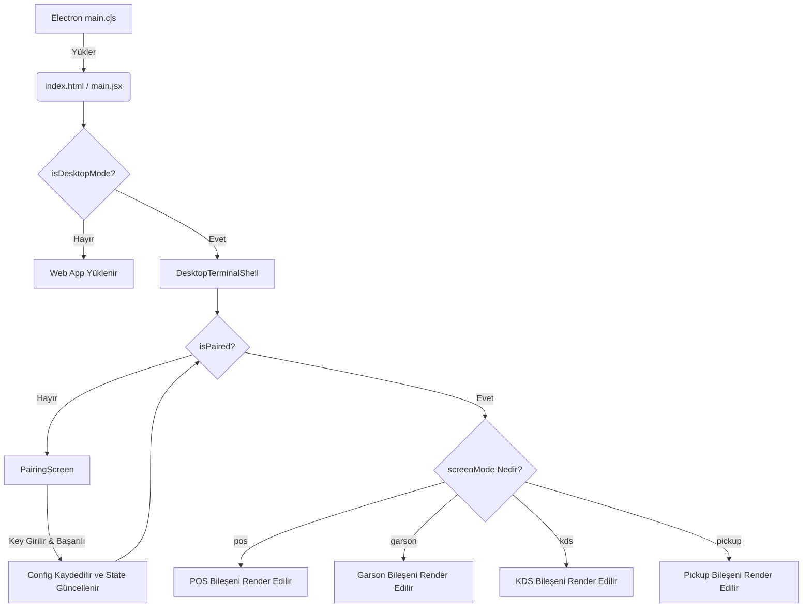

# Desktop Terminal Architecture & Routing Redesign

Mevcut yapıda POS, Garson, KDS ve Pickup ekranlarının yanlış açılmasına (örneğin POS anahtarının Garson ekranını açması) neden olan temel mimari hatalar tespit edilmiştir:
1. **Dev/Prod Uyuşmazlığı**: Geliştirme (Dev) ortamında `index.html` üzerinden `App.jsx` çalışırken, production ortamında `desktop.html` üzerinden `DesktopPosApp.jsx` çalışmaktadır. Bu durum, rotaların ve PairingGuard'ın farklı tepkiler vermesine yol açmaktadır.
2. **Race Condition (Yarış Durumu)**: Eşleştirme sonrasında `window.location.replace()` yapıldığında, Electron tarafında konfigürasyon dosyaya henüz tam olarak yansımamış veya web ortamında (localStorage) eski veri okunmuş olabiliyor.
3. **Route Karmaşası**: `/garson-screen`, `/pos-screen` gibi rotalar ile `DesktopPosApp.jsx` içindeki `/garson` ve `/pos` rotaları çakışmaktadır.

Bu sorunları kökten çözmek için mimariyi baştan aşağı yeniden yapılandırmalıyız.

## Önerilen Mimari Yapı

### 1. Tekil Giriş Noktası (Unified Entry)
Desktop uygulaması ve Web uygulaması arasındaki ayrımı `index.html` veya `desktop.html` seviyesinde yapmak yerine, uygulamanın tek bir giriş noktasından (`App.jsx`) yönetilmesi sağlanmalıdır.
- `App.jsx` içerisinde `isDesktopMode()` kontrolü yapılarak, eğer uygulama masaüstü ortamında (Electron) çalışıyorsa standart Web arayüzü yerine **`DesktopTerminalShell`** bileşeni render edilecektir.
- Böylece dev ve prod ortamlarındaki tutarsızlıklar tamamen ortadan kalkacaktır.

### 2. DesktopTerminalShell ve PairingGuard
- **`DesktopTerminalShell`**: Sadece masaüstü ortamında çalışacak olan ana kapsayıcıdır.
- İçerisinde **`PairingGuard`** bulunur. Uygulama açıldığında lokal konfigürasyon (`terminal-config.json`) okunur. 
- Eğer cihaz henüz eşleştirilmemişse (veya eşleştirme anahtarı geçersizse), ekranda sadece **`PairingScreen`** gösterilir.
- Eşleştirme tamamlandığında sayfa **yenilenmez** (`window.location.replace` KULLANILMAZ). Bunun yerine React state güncellenir ve yeni konfigürasyon anında devreye girerek doğru ekrana geçiş yapılır.

### 3. Screen Mode Yönlendirmesi (Routing)
Eşleştirme işlemi sonrası (veya cihaz zaten eşleşmişse) alınan `device_type` verisi üzerinden cihazın açması gereken ekran net bir şekilde belirlenir:
- `pos` -> `/pos`
- `masa` veya `garson` -> `/garson`
- `kds` -> `/kds`
- `pickup` -> `/pickup`

Terminal konfigürasyonunda yer alan `screenMode` değerine göre React Router doğrudan ilgili sayfayı yükler.

## Mimari Akış Diyagramı (Mermaid)

## User Review Required

> [!IMPORTANT]
> - `main.desktop.jsx` ve `desktop.html` gibi karmaşaya yol açan ara dosyalar kullanımdan kaldırılacak ve tüm yapı `App.jsx` üzerinden yönetilecektir.
> - Eşleştirme sonrasında sayfa yenilenmesi kaldırılacağı için, geçişler anında ve sorunsuz olacaktır.
> - Veritabanındaki `device_type` ne ise (`pos`, `masa`, `kds`, `pickup`), terminal **sadece ve kesinlikle** o ekran modunda başlayacaktır.

Bu yeni mimari planı onaylıyorsanız, eski `DesktopPosApp.jsx` yapısını temizleyip bu temiz ve sağlam mimariyi `App.jsx` ve `main.cjs` üzerine entegre edeceğim. Lütfen onay verin.
