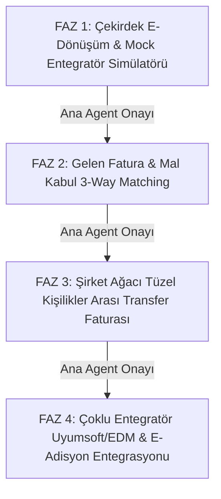

# Restoran E-Dönüşüm ve E-Fatura Entegrasyonu Uygulama Planı

Bu plan; SuitableRMS sistemine Gelir İdaresi Başkanlığı (GİB) mevzuatına tam uyumlu, Özel Entegratör modeli tabanlı, UBL-TR 2.1 standardında ve Adaptör Tasarım Deseni ile çalışan kapsamlı bir **E-Dönüşüm ve E-Fatura Altyapısı** kazandırmayı hedefler.

Planlama, her fazın bağımsız subagent'lar aracılığıyla geliştirileceği ve ana agent tarafından denetlenip onaylanacağı/reddedileceği aşamalı bir yönetim mimarisine dayanmaktadır.

---

## Kullanıcı İncelemesi Gereken Konular

> [!IMPORTANT]
> **Subagent Orkestrasyonu ve Kalite Denetimi:**
> Her faz için özel bir subagent atanacak; subagent geliştirme tamamlandığında ana agent kodları satır satır denetleyecek, derleme ve DB kurallarını (`.antigravityrules.md`, `DESIGN_HANDBOOK_V3_TR.md`) doğrulayacak ve onay verirse bir sonraki faza geçecektir.

> [!NOTE]
> **Mock Entegratör Simülatörü:**
> Faz 1'de inşa edilecek olan simülatör, gerçek bir e-Fatura entegratörünün (Uyumsoft, EDM vb.) sunduğu tüm API davranışlarını (Gelen faturalar, Giden faturalar, UBL-TR XML/HTML görseli, 1000->1300 durum geçişleri, Ticari Fatura Kabul/Red yanıtları) yerel ortamda %100 birebir simüle edecektir.

---

## Açık Sorular

* **Fatura İptal / İade Süresi:** Ticari e-Faturalara yasal olarak 8 gün içinde sistem üzerinden Kabul/Red yanıtı verilebilmektedir. Simülatörde ve UI'da 8 günlük süreyi aşan faturalar için "Süre Aşımı / Otomatik Kabul" uyarısı gösterilsin mi? *(Plana varsayılan olarak 8 gün kontrolü eklenmiştir.)*
* **Mal Kabul Toleransı:** Mal kabul irsaliyesi ile fatura miktar/fiyat karşılaştırmasında varsayılan kuruş/yüzde toleransı (Örn: %1 fiyat veya 0.05 kg tartım toleransı) parametrik mi olsun? *(Plana sistem ayarlarında tutulacak şekilde eklenmiştir.)*

---

## Fazlar ve Subagent Görev Dağılımı

```mermaid
graph TD
    A[FAZ 1: Çekirdek E-Dönüşüm & Mock Entegratör Simülatörü] -->|Ana Agent Onayı| B[FAZ 2: Gelen Fatura & Mal Kabul 3-Way Matching]
    B -->|Ana Agent Onayı| C[FAZ 3: Şirket Ağacı Tüzel Kişilikler Arası Transfer Faturası]
    C -->|Ana Agent Onayı| D[FAZ 4: Çoklu Entegratör Uyumsoft/EDM & E-Adisyon Entegrasyonu]
```

---

## FAZ 1: Çekirdek E-Dönüşüm Altyapısı & Mock Entegratör Simülatörü

### 1.1. Veritabanı Şeması
- `e_invoices`: Fatura üst bilgileri (ETTN UUID, Fatura No, Tür: SATIS/IADE/TEVKIFAT, Senaryo: TICARIFATURA/TEMELFATURA/EARSIVFATURA, Yön: IN/OUT, Durum: 1000-1300, Toplamlar, KDV, VKN/TCKN, Gönderici/Alıcı).
- `e_invoice_lines`: Fatura satırları (Kalem adı, Stok eşleme ID, Miktar, Birim, Birim Fiyat, KDV Oranı, KDV Tutarı, İskonto).
- `e_integrator_configs`: Entegratör ayarları (Aktif sağlayıcı: `mock`, `uyumsoft`, `edm`, API URL, Kullanıcı adı, Şifre, Şube/Tüzel kişilik bazlı).
- `e_document_responses`: Ticari faturalara verilen Kabul/Red/İade uygulama yanıtları.
- `e_invoice_matching_logs`: Mal kabul ve irsaliye eşleşme geçmişi.

### 1.2. Çekirdek UBL-TR & Adaptör Mimarisi (`src/lib/eInvoice/`)
- `types.js`: E-Dönüşüm veri tipleri, GİB durum kodları, vergi tipleri.
- `coreUblGenerator.js`: UBL-TR 2.1 standardında evrensel XML ve JSON üreteci (`AdditionalDocumentReference` desteği ile).
- `integratorAdapter.js`: `IEInvoiceAdapter` ortak sözleşmesi.
- `mockIntegratorAdapter.js`: Senaryo bazlı hayali faturalar üreten, gelen/giden kutusu yöneten, durum değiştiren simülatör adaptörü.
- `eInvoiceService.js`: UI ve servisler için yüksek seviyeli arayüz.

### 1.3. Backend Mock Servisleri (`server/`)
- `/api/einvoice/mock/inbox`: Simüle gelen faturaları listeleme.
- `/api/einvoice/mock/generate-scenario`: Test senaryoları üretme (Örn: "Meyve Tedarikçisi Faturası", "Fiyat Farklı Fatura").
- `/api/einvoice/send`: Fatura gönderme.
- `/api/einvoice/response`: Kabul/Red yanıtı iletme.
- `/api/einvoice/status/:id`: Durum güncelleme (1000 -> 1100 -> 1200 -> 1300).

### 1.4. Arayüz: E-Fatura Yönetim Portalı & Simülatör (`src/components/pages/EInvoiceManager.jsx`)
- **Gelen Kutusu & Giden Kutusu:** Gelişmiş filtreleme, durum rozetleri, arama, tarih aralığı.
- **Fatura Görsel Önizleme Modalı:** Standart GİB şablonunda HTML/XSLT fatura görseli.
- **Simülatör Kontrol Paneli:** "Senaryo Faturası Üret", "Durumu 1300 Yap", "Gelen Kutusunu Yenile" butonları.
- **Ticari Yanıt Modalı:** Kabul / Red gerekçesi girip yanıt gönderme.

---

## FAZ 2: Gelen e-Fatura ile Mal Kabul (İrsaliye) 3-Way Matching

### 2.1. Eşleştirme Motoru
- Gelen faturanın VKN'si üzerinden sistemdeki `suppliers` tablosu ile otomatik eşleşme.
- Faturadaki irsaliye numaraları / tarihleri üzerinden ilgili şubenin `purchase_receipts` kayıtlarının bulunması.
- Satır bazında miktar (irsaliyedeki teslimat vs faturadaki miktar) ve birim fiyat (siparişteki fiyat vs faturadaki fiyat) karşılaştırması.

### 2.2. Kullanıcı Arayüzü & Aksiyonlar
- **Fatura Eşleştirme Ekranı:** Yan yana (Split View) Fatura Satırları vs İrsaliye Satırları.
- **Uyuşmazlık Uyarıları:** Fiyat farkı veya miktar eksiği/fazlası durumunda sarı/kırmızı uyarılar.
- **Eşleşme Onayı:** Fatura onaylandığında `cari_hareketler`'e borç kaydı ve `purchase_receipts.invoice_matched = true` işlenmesi.

---

## FAZ 3: Şirket Ağacı ve Tüzel Kişilikler Arası Transferlerin Faturalaşması

### 3.1. Tüzel Kişilik Tanımları
- `company_nodes` tablosundaki düğümlere tüzel kişilik özellikleri (`vkn`, `vergi_dairesi`, `legal_title`, `address`) entegrasyonu.

### 3.2. Otomatik Transfer Faturası Motoru
- Şubeler/Depolar arası stok transferi (`inventory_movements` / `transfer`) tamamlandığında:
  - Gönderen ve alan düğümlerin VKN'leri farklı ise sistem bunu "Tüzel Kişilikler Arası Transfer" olarak algılar.
  - Gönderen şirket adına **e-İrsaliye** ve **e-Fatura** taslağı otomatik oluşturulur.
  - Alıcı tüzel kişiliğin Gelen Kutusuna otomatik düşürülür.

---

## FAZ 4: Çoklu Entegratör (Uyumsoft / EDM) & E-Adisyon

### 4.1. Gerçek Entegratör Adaptörleri
- `UyumsoftAdapter`: SOAP 1.1 / BasicHttpBinding veya REST entegrasyonu.
- `EdmAdapter`: WCF / SessionID tabanlı entegrasyon.

### 4.2. E-Adisyon Entegrasyonu
- Restoranda sipariş açıldığında ETTN üretimi.
- Masa hesabı kapatıldığında e-Fatura/e-Arşiv kesilirken `AdditionalDocumentReference` ile E-Adisyon ETTN bağlantısı kurulması.

---

## Doğrulama Planı

### Otomatik Testler
1. **Derleme Testi:** `npm run build` (Sıfır hata ile tamamlanmalı).
2. **Schema & Veritabanı Doğrulaması:** VPS PostgreSQL üzerinde tabloların ve kısıtlamaların oluşturulması.
3. **API & Servis Testleri:** Mock entegratör endpoint'lerinin Node.js üzerinden test edilmesi (`test_einvoice_mock.mjs`).

### Manuel Doğrulama
1. **Fatura Üretimi ve Gelen Kutusu:** Simülatörden "Tedarikçi A - 3 Kalemlik Fatura" üretilip Gelen Kutusuna düştüğü doğrulanacak.
2. **Fatura Önizleme:** Faturaya tıklandığında standart GİB faturası şeklinde görüntülendiği doğrulanacak.
3. **Ticari Yanıt:** Faturaya "Kabul" veya "Red" yanıtı verildiğinde durumun ve logların güncellendiği teyit edilecek.
4. **Mal Kabul Eşleştirmesi:** Mal kabul irsaliyesi ile gelen faturanın miktar/fiyat eşleşmesi test edilecek.
