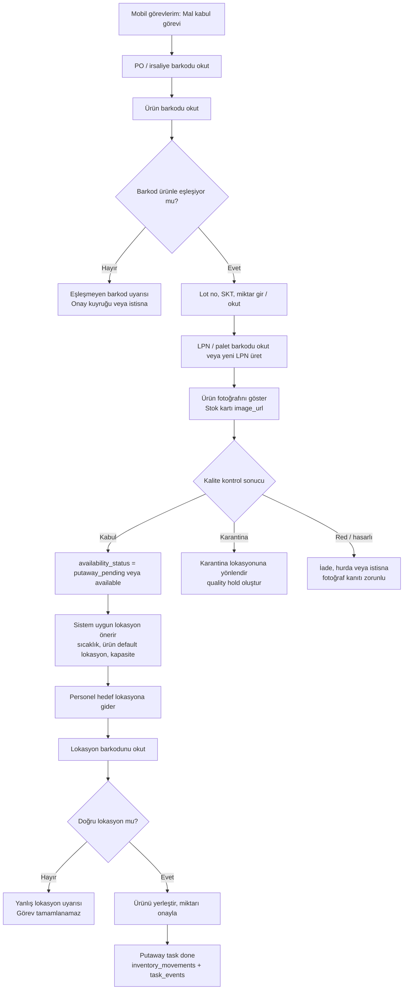
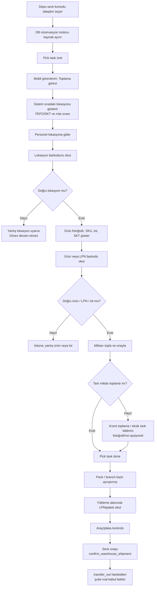

# WMS Depo Yönetim Sistemi Analizi ve Proje Planı

Tarih: `2026-06-11`
Hazırlayan: `Codex`
Kapsam: SuitableRMS Ana Depo / WMS modülünün mevcut kod ve şema durumunu, dış WMS referansları ve kullanıcı tarafından paylaşılan Mermaid akışları ile karşılaştırarak eksik/fazla noktaları ve uygulanabilir proje planını çıkarmak.

---

## 1. Kısa Sonuç

SuitableRMS içinde WMS için ciddi bir temel atılmış durumda. Sistem artık yalnızca "depo siparişi" ekranı değildir; lokasyon, LPN/palet, depo mal kabul, lot/SKT, karantina/putaway statüsü, kullanılabilir stok ayrımı, depo sevkiyat konsolu, sevkiyat satırı kaynak seçimi ve atomik sevk RPC'si gibi çekirdek parçalar var.

Ancak klasik bir WMS'in eksiksiz çalışması için üç büyük omurga hâlâ eksik ya da yarım:

1. **Rezervasyon motoru:** Stok, sevkiyat oluşturma anında DB seviyesinde rezerve edilmiyor. Depo konsolu FEFO benzeri kaynak seçiyor, ancak aynı stok başka işlemle tüketilebilir.
2. **WMS görev motoru:** Putaway, pick, pack, count, replenish gibi işler için stok hareketine bağlı, terminal/personel atamalı görev tablosu ve durum makinesi yok.
3. **Mobil/barkod operasyon katmanı:** LPN ve GS1-SSCC kod üretimi var, fakat mal kabul, putaway ve picking akışları gerçek barkod okutma zorunluluğu ile çalışmıyor.

Bu nedenle önerilen proje yönü: mevcut yapıyı çöpe atmadan, `purchase_orders`, `inventory_movements`, `warehouse_locations`, `warehouse_lpns` ve `warehouse_shipments` etrafında devam etmek; fakat rezervasyon, görev ve barkod katmanını yeni DB-first tablolarla tamamlamak.

---

## 1.1. Tüm WMS Projesi Diyagramı

Bu diyagramda mobil uygulama destekleyici değil, operasyonun ana yürütme katmanıdır. Web panel planlama, onay, izleme ve istisna yönetimi için kullanılır; fiziksel depo hareketleri ise mobil uygulama ve barkod doğrulama üzerinden tamamlanır.

```mermaid
flowchart TB
  subgraph External["Dış ve İç Kaynaklar"]
    BranchOrders["Şube siparişleri / ikmal talepleri"]
    SupplierPO["Tedarikçi satınalma siparişleri"]
    ManualOps["Sayım, zayi, manuel depo işlemleri"]
  end

  subgraph Web["Web Yönetim Paneli"]
    WmsConsole["Ana Depo sevk konsolu"]
    Purchasing["Depo satınalma planlama"]
    Locations["Lokasyon, zone, raf, göz yönetimi"]
    Lpns["LPN / palet yönetimi"]
    StockParams["Ürün bazlı depo parametreleri"]
    Reports["WMS raporları ve istisna yönetimi"]
  end

  subgraph Core["DB-First WMS Çekirdeği"]
    Reservation["Rezervasyon motoru\nwarehouse_reservations"]
    TaskEngine["Görev motoru\nwarehouse_tasks"]
    RuleEngine["Kural motoru\nFEFO/FIFO, sıcaklık, lokasyon, kapasite"]
    InventoryLedger["Immutable stok hareket defteri\ninventory_movements"]
    ShipmentRpc["Atomik sevkiyat RPC\nconfirm_warehouse_shipment"]
    Quality["Kalite / karantina / release akışı"]
  end

  subgraph Mobile["Mobil WMS Uygulaması"]
    MobileHome["Görevlerim"]
    ReceivingMobile["Barkodlu mal kabul"]
    PutawayMobile["Putaway / rafa yerleştirme"]
    PickMobile["Lokasyon yönlendirmeli toplama"]
    PackLoadMobile["Paketleme ve yükleme kontrolü"]
    CountMobile["Barkodlu sayım"]
    PhotoProof["Ürün fotoğrafı ve kanıt fotoğrafı"]
  end

  subgraph Physical["Fiziksel Depo"]
    Dock["Mal kabul / sevkiyat alanı"]
    Quarantine["Karantina alanı"]
    ReserveLoc["Reserve lokasyonlar"]
    PickFace["Pick-face lokasyonlar"]
    Vehicle["Araç / sevkiyat"]
  end

  subgraph Data["Railway Postgres"]
    PO["purchase_orders / lines"]
    WL["warehouse_locations"]
    LPN["warehouse_lpns"]
    WS["warehouse_shipments / lines"]
    WT["warehouse_tasks / events"]
    WR["warehouse_reservations"]
    IM["inventory_movements"]
    PEB["product_external_barcodes"]
  end

  BranchOrders --> PO
  SupplierPO --> PO
  ManualOps --> TaskEngine

  WmsConsole --> Reservation
  Purchasing --> PO
  Locations --> WL
  Lpns --> LPN
  StockParams --> RuleEngine
  Reports --> IM
  Reports --> WT
  Reports --> WR

  PO --> Reservation
  Reservation --> TaskEngine
  RuleEngine --> TaskEngine
  TaskEngine --> MobileHome

  MobileHome --> ReceivingMobile
  MobileHome --> PutawayMobile
  MobileHome --> PickMobile
  MobileHome --> PackLoadMobile
  MobileHome --> CountMobile

  ReceivingMobile --> Dock
  ReceivingMobile --> Quality
  Quality --> Quarantine
  Quality --> PutawayMobile
  PutawayMobile --> ReserveLoc
  PutawayMobile --> PickFace
  PickMobile --> ReserveLoc
  PickMobile --> PickFace
  PackLoadMobile --> Vehicle
  CountMobile --> ReserveLoc
  CountMobile --> PickFace

  ReceivingMobile --> PhotoProof
  PutawayMobile --> PhotoProof
  PickMobile --> PhotoProof
  PackLoadMobile --> PhotoProof

  ShipmentRpc --> IM
  TaskEngine --> WT
  Reservation --> WR
  InventoryLedger --> IM
  ReceivingMobile --> IM
  PutawayMobile --> IM
  PickMobile --> WS
  PackLoadMobile --> ShipmentRpc
  CountMobile --> IM
  ReceivingMobile --> PEB

  WL --> RuleEngine
  LPN --> RuleEngine
  IM --> Reservation
  IM --> RuleEngine
```



---

## 1.2. Mobil Uygulama Kritik Rolü

Mobil uygulama WMS projesinin en önemli ayaklarından biridir. Web panelde planlanan ve onaylanan işler, depoda ancak mobil uygulama ile gerçek fiziksel doğrulamaya dönüşür. Bu yüzden mobil uygulama "sonradan eklenecek kolaylık" değil, Faz 2 ve Faz 3'ün ana teslimatıdır.

Mobil uygulama şu kurallarla tasarlanmalıdır:

- **Teslim alma barkodla yapılmalı:** Tedarikçi ürünü, LPN/palet, lot, SKT ve gerekirse irsaliye/PO barkodu okutulmadan mal kabul tamamlanmamalı.
- **Lokasyon doğrulaması zorunlu olmalı:** Putaway ve picking sırasında personel hedef/kaynak lokasyonun üzerindeki barkodu okutmalı; yanlış lokasyonda işlem fail-closed hata vermeli.
- **Toplama lokasyon yönlendirmeli olmalı:** Sistem personele ürün, miktar, LPN, lot/SKT ve raf/göz sırasını göstermeli; özellikle FEFO için önce hangi lokasyona gidileceğini kendisi önermeli.
- **Ürün fotoğrafı gösterilmeli:** Stok kartında yüklenmiş `image_url` varsa mobil toplama ve mal kabul ekranında ürün fotoğrafı gösterilmeli. Görsel yoksa SKU, ad, birim, kategori ve barkod bilgisi öne çıkarılmalı.
- **Kanıt fotoğrafı alınabilmeli:** Hasar, eksik, fazla, yanlış ürün, karantina ve teslimat kabul durumlarında mobil uygulama fotoğraf yükleyebilmeli. Dosyalar proje kuralına uygun şekilde Railway Volume `UPLOAD_DIR` altında kalmalı, DB'ye dosya yolu yazılmalı.
- **İstisna akışı olmalı:** Eksik miktar, yanlış lokasyon, yanlış lot, SKT geçmiş ürün, hasarlı ürün, barkod eşleşmedi gibi durumlarda görev `exception` statüsüne düşmeli.
- **Personel ve cihaz izi tutulmalı:** Her okutma, fotoğraf, miktar onayı ve görev tamamlaması `warehouse_task_events` içine personel/PIN bağlamı, terminal id, zaman damgası ve payload ile yazılmalı.

### Mobil Teslim Alma ve Putaway Akışı



### Mobil Picking ve Sevkiyat Akışı



---

## 2. Dış WMS Araştırma Özeti

Microsoft Dynamics 365 WMS dokümanı, modern WMS'i satınalma, transfer, satış, iade, üretim, kalite ve nakliye süreçleriyle entegre çalışan bir depo operasyon modülü olarak tanımlar. Aynı kaynakta WMS kurulumu için `wave templates`, `work templates`, `work pools` ve `location directives` gibi iş/lokasyon kuralları vurgulanır. Ayrıca batch/serial destekleri, barkod okuyucular, lokasyon limitleri, sayım, etiket basımı, worker traceability, outbound wave processing, packing ve cross-docking standart kabiliyetler arasındadır.

Odoo Inventory doküman yapısı da aynı alanları destekler: lot/seri/SKT, depo ve lokasyonlar, cycle count, replenishment, route/push-pull rules, putaway rules, reservation methods, batch/cluster/wave picking ve FIFO/LIFO/FEFO removal strategies.

PostgreSQL tarafında WMS gibi yarış koşulu hassas işlerde `SELECT ... FOR UPDATE` önemli bir yapı taşıdır; satırları işlem bitene kadar kilitleyerek aynı stok veya sevkiyat kaydının eşzamanlı güncellenmesini engeller. Daha geniş bütünlük gereken yerlerde `SERIALIZABLE` izolasyon da kullanılabilir, ancak retry stratejisi gerektirir.

Bu araştırmadan SuitableRMS için çıkan ana ders: WMS, sadece stok bakiyesi göstermek değildir. Doğru kurguda her fiziksel hareket bir **belge + rezervasyon + görev + tarama/onay + immutable movement log** zinciriyle ilerlemelidir.

Kaynaklar:

- Microsoft Learn: Warehouse management overview - https://learn.microsoft.com/en-us/dynamics365/supply-chain/warehousing/warehouse-management-overview
- Odoo Inventory documentation - https://www.odoo.com/documentation/19.0/applications/inventory_and_mrp/inventory.html
- PostgreSQL Explicit Locking - https://www.postgresql.org/docs/current/explicit-locking.html
- PostgreSQL Transaction Isolation - https://www.postgresql.org/docs/current/transaction-iso.html

---

## 3. Kullanıcının Paylaştığı Mermaid Akışları Üzerine Not

Okunan SVG dosyaları üç ana akış öneriyor:

1. `deepseek_mermaid_20260611_f68f77 (1).svg`: Şube talebi -> depo onayı -> wave -> FEFO kaynak belirleme -> pick task -> mobil toplama -> pack -> evrak -> sevk.
2. `deepseek_mermaid_20260611_5aaefb.svg`: Tedarikçiden mal gelişi -> PO -> barkod -> lot/SKT -> kalite kontrol -> kabul -> lokasyon önerisi -> putaway task -> rafa koyma -> muhasebeye irsaliye.
3. `deepseek_mermaid_20260611_bc5474.svg`: Dış sistemler, entegrasyon gateway, servisler, PostgreSQL, web panel ve mobil cihaz mimarisi.

Bu akışlar konsept olarak doğru. SuitableRMS'e doğrudan alınırken iki düzeltme gerekir:

- `Mesaj Kuyruğu / Kafka` gibi ağır altyapılar şu an gereksiz. Proje canlı yoğun kullanımda değil; mevcut kural gereği kısa aralıklı arka plan trafik ve gereksiz mimari ağırlık eklenmemeli. İlk fazda DB transaction + RPC + manuel yenileme yeterlidir.
- `Mobil cihazlara düşer` kısmı gerçek görev motoru olmadan tamamlanmış sayılmaz. Bugünkü ekranlar web panel ve select/dropdown ağırlıklıdır; gerçek WMS için barkod okutma ve görev durum makinesi şarttır.

---

## 4. Mevcut SuitableRMS WMS Durumu

### 4.1. Mevcut Sayfalar ve Rotalar

WMS modülü `src/App.jsx` içinde Ana Depo route'larıyla ayrılmış:

- `/depo-orders`: Şube Talepleri / Sevk Konsolu (`DepoOrders.jsx`)
- `/depo-satinalma`: Depo Satınalma Siparişleri (`Orders.jsx`)
- `/depo-mal-kabul`: Mal Kabul & Putaway (`MalKabul.jsx`)
- `/depo-iclokasyon-tasima`: Depo içi lokasyon/LPN taşıma (`WmsInternalTransfer.jsx`)
- `/wms-locations`: Lokasyonlar (`WmsLocations.jsx`)
- `/wms-lpns`: LPN / Paletler (`WmsLpns.jsx`)
- `/wms-stock-params`: Ana depo stok parametreleri (`WmsStockParams.jsx`)

Bu rota ayrımı doğru. WMS'in şube POS/satınalma akışlarından izole yönetilmesini sağlıyor.

### 4.2. Mevcut Veritabanı Yapısı

Şemada WMS için şu parçalar mevcut:

- `warehouse_locations`: depo, zone, aisle, rack, level, bin, sıcaklık sınıfı, usage type.
- `warehouse_lpns`: LPN/palet kodu, depo, durum; sonradan `location_id`, `notes`, `updated_at` eklenmiş.
- `stock_item_warehouse_settings`: stok ürünü + ana depo bazında min/max/safety/default location/sevk fiyat marjı.
- `product_external_barcodes`: GTIN / dış barkod eşleştirme altyapısı.
- `inventory_movements`: WMS için `location_id`, `lpn_id`, `lot_number`, `expiration_date` kolonları.
- `warehouse_shipments`, `warehouse_shipment_orders`, `warehouse_shipment_lines`: WMS sevkiyat partisi ve satırları.
- `confirm_warehouse_shipment(...)`: sevkiyatı DB tarafında `FOR UPDATE` ile kilitleyip `transfer_out` hareketlerini üreten RPC.

Pozitif taraf: WMS şemasının ana iskeleti DB-first biçimde oluşmuş.

Temizlik gereği: Bazı kolonlar ana `CREATE TABLE` bloğunda değil, dosyanın ilerleyen `WMS TAMAMLAMA` bölümünde `ALTER TABLE ... ADD COLUMN IF NOT EXISTS` ile ekleniyor. Bu çalışır, ancak master schema okunabilirliği için ileride tekil/temiz tablo tanımlarına normalize edilmeli.

### 4.3. Inbound / Mal Kabul

`MalKabul.jsx` depo modunda WMS alanlarını açıyor:

- Lokasyon zorunlu.
- LPN seçimi var.
- Lot no ve SKT girilebiliyor.
- `availability_status`: `available`, `quarantine`, `putaway_pending`.
- `warehouse_replenishment` siparişleri şube kabulüne ancak depo sevk kanıtı (`meta.supplier_marked_sent`) varsa düşüyor.

Bu doğru bir tasarım. En önemli eksik: `putaway_pending` seçilen ürün için otomatik `PUTAWAY` görevi oluşmuyor. Kullanıcı daha sonra lokasyon taşıma yapabilir, ama bu bir görev kuyruğu ve barkod onaylı putaway tamamlandı kaydı değildir.

### 4.4. Outbound / Sevkiyat

`DepoOrders.jsx` tarafında:

- `warehouse_replenishment` talepleri filtreleniyor.
- Sevkiyat partisi oluşturuluyor.
- Stok kaynakları lokasyon/LPN/lot/SKT kombinasyonuna göre hesaplanıyor.
- `quarantine` ve `putaway_pending` stoklar picking dışı bırakılıyor.
- SKT varsa erken tarih önce gelecek şekilde FEFO benzeri sıralama yapılıyor.
- Seçilen kaynaklar `warehouse_shipment_lines.meta.picks` içine yazılıyor.
- Sevk onayı `confirm_warehouse_shipment` RPC ile DB tarafında stok çıkışı üretiyor.

Bu, mevcut WMS'in en güçlü kısmı.

Ancak bugün bu yapı hâlâ tam WMS rezervasyonu değildir. Pick kaynakları client tarafındaki `inventoryMovements` snapshot'ından hesaplanıyor. Sevkiyat onayı shipment satırını kilitliyor, fakat seçilen kaynak stoğun o anda hâlâ yeterli olduğunu DB içinde kaynak bazında yeniden kilitleyip doğrulamıyor. Aynı ürün/lokasyon/lot başka bir işlemle tüketilirse over-pick riski doğabilir.

### 4.5. Stok Kullanılabilirliği

`branchPurchasing.js`, `DepoOrders.jsx`, `Count.jsx` ve `InventoryOperationRecord.jsx` içinde `availability_status` ayrımı dikkate alınmaya başlamış. `quarantine` ve `putaway_pending` fiziksel stokta görünse bile kullanılabilir stoktan düşülüyor.

Bu karar doğru. Eksik olan şey, bu durumların lifecycle kontrolü:

- Karantinadan kullanılabilire kim, hangi görev/onayla geçirir?
- Putaway pending stok, hangi lokasyon görevinden sonra available olur?
- Bu geçişler audit log ve personel/cihaz bilgisiyle tutuluyor mu?

Bugünkü sistemde bu geçişler net bir WMS statü tablosu ve görev olayı olarak modellenmemiş.

### 4.6. Depo Talep Planlama

`warehouseDemandPlanning.js` ana depo dış satınalma önerisi için iyi bir pure hesaplama motoru içeriyor. Şube net ihtiyaçları, depo güvenlik stoku, inbound yolda stok ve sipariş yuvarlama kuralları düşünülmüş.

Kritik açık: Dosyada `reserved = 0` sabit kalıyor. Bu, rezervasyon motorunun henüz gerçek olmadığına açık kanıt. WMS tamamlandığında depo pozisyonu şu hale gelmeli:

```text
depo_pozisyonu = available_stock + inbound_open_qty - reserved_qty - allocated_pick_qty
```

### 4.7. LPN / Barkod

`WmsLpns.jsx` içinde iç LPN kodlama ve GS1-128 SSCC benzeri kod üretimi bulunuyor. Bu iyi bir temel.

Eksik kalanlar:

- Mal kabulte ürün barkodu okutma zorunluluğu yok.
- Lokasyon barkodu okutma zorunluluğu yok.
- LPN barkodu okutma/etiket basma akışı yok.
- `product_external_barcodes` tablosu var, ama ürün-barkod onay ekranı ve WMS tarama motoru görünmüyor.
- GS1 şirket prefiksi girilebiliyor, fakat etiket basımı ve AI parse standardı uçtan uca yok.

---

## 5. Eksik / Fazla / Doğru Yapılanlar

### Doğru Yapılanlar

- DB-first mimariye uyulmuş; ana veri kaynakları Railway Postgres tabloları.
- WMS route'ları Ana Depo bağlamına ayrılmış.
- İç depo tedarikçisi (`supplier_kind = internal_warehouse`) ve `flow_channel = warehouse_replenishment` kararı doğru.
- WMS ikmal talebi için ayrı tablo açmayıp `purchase_orders` ortak yapısını kullanma kararı doğru; mevcut sipariş motorunun kopyalanmasını engelliyor.
- Lokasyon, LPN, lot, SKT ve sevkiyat satırı kaynakları stok hareket defteriyle bağlanmış.
- Karantina ve putaway pending stokların kullanılabilir stoktan ayrılması doğru.
- Sevkiyat onayının RPC ile atomik/idempotent yapılması doğru yönde.
- Ana depo sevk fiyatı marj kuralı doğru ayrıştırılmış; depo dış satınalma fiyatı ile şube sevk fiyatı ayrılabiliyor.

### Eksik Olanlar

- DB seviyesinde `warehouse_reservations` / allocation tablosu yok.
- Pick/putaway/count/replenish için WMS görev tablosu yok.
- Mobil terminal veya tarama odaklı ekran yok.
- Barkod parse/etiket basım servisi yok.
- Putaway lifecycle net değil; `putaway_pending` seçimi görev üretmiyor.
- Karantina kalite kontrol onayı ayrı bir süreç değil.
- Cycle count planlama ve sayım görevleri WMS seviyesinde yok.
- Pick-pack-ship ayrımı tek sevkiyat konsolunda kısmen birleşik ilerliyor; packing ve yükleme kontrol noktaları ayrı değil.
- Wave/batch picking stratejisi kavram olarak yok; konsol sipariş seçip sevkiyat partisi oluşturuyor.
- Replenishment iç depo pick-face tamamlama kuralı yok.
- Depo personeli performansı, iş süresi, cihaz, tarama kanıtı takip edilmiyor.
- Canlı stok tüketimi POS/reçete tarafıyla WMS stok defteri arasında hâlâ ayrıca doğrulanması gereken bir alan.

### Fazla veya Şimdilik Ertelenmesi Gerekenler

- Kafka/RabbitMQ gibi mesaj kuyruğu altyapısı ilk faz için gereksiz. Proje trafiği düşükken DB transaction/RPC ve manuel yenileme daha doğru.
- Tam otomatik wave optimizasyonu ilk sürümde ağır kalır. Önce manuel wave/parti + rezervasyon + görev üretimi yapılmalı.
- RFID ilk fazda gereksiz. Barkod/QR/GS1-128 yeterli.
- Çok karmaşık slotting algoritması ilk fazda gereksiz. Önce ürün bazlı default location + sıcaklık/usage uyumu + kapasite uyarısı yeterli.

---

## 6. Önerilen Hedef Mimari

### 6.1. Çekirdek Prensip

Her WMS hareketi şu zincirden geçmeli:

```text
Belge/Talep
  -> Rezervasyon veya kabul bekleyen stok
  -> WMS görevi
  -> Barkod/LPN/Lokasyon doğrulaması
  -> Inventory movement
  -> Durum güncellemesi
  -> Audit/activity log
```

### 6.2. Önerilen Yeni Tablolar

#### `warehouse_reservations`

Amaç: Sevkiyat veya görev için ayrılan stoğu DB seviyesinde tutmak.

Önerilen alanlar:

```sql
id uuid primary key
branch_id uuid not null
stock_item_id uuid not null
location_id uuid null
lpn_id uuid null
lot_number text null
expiration_date date null
source_doc_type text not null -- warehouse_shipment, pick_task, manual_hold
source_doc_id uuid not null
reserved_qty numeric(18,4) not null
status text not null -- active, consumed, released, expired, cancelled
reserved_by text null
reserved_at timestamptz default now()
consumed_at timestamptz null
released_at timestamptz null
meta jsonb default '{}'
```

Kurallar:

- Aynı stok kaynağı için `available - active_reservations` hesaplanmalı.
- Sevkiyat taslağı oluşturulurken kaynaklar DB transaction içinde rezerve edilmeli.
- Sevkiyat onayında reservation `consumed` olmalı.
- Sevkiyat iptalinde reservation `released` olmalı.

#### `warehouse_tasks`

Amaç: WMS işlerini terminal/personel seviyesinde yürütmek.

Önerilen alanlar:

```sql
id uuid primary key
branch_id uuid not null
task_no text unique not null
task_type text not null -- putaway, pick, pack, count, replenish, move, qc
status text not null -- pending, assigned, in_progress, done, exception, cancelled
priority int default 50
assigned_to_staff_id uuid null
assigned_terminal_id text null
source_doc_type text not null
source_doc_id uuid not null
stock_item_id uuid null
expected_qty numeric(18,4) null
completed_qty numeric(18,4) null
from_location_id uuid null
to_location_id uuid null
from_lpn_id uuid null
to_lpn_id uuid null
lot_number text null
expiration_date date null
started_at timestamptz null
completed_at timestamptz null
meta jsonb default '{}'
```

#### `warehouse_task_events`

Amaç: Audit ve barkod kanıtı.

```sql
id uuid primary key
task_id uuid not null
event_type text not null -- scan_item, scan_location, scan_lpn, qty_confirm, exception, complete
event_at timestamptz default now()
staff_id uuid null
terminal_id text null
barcode_value text null
payload jsonb default '{}'
```

#### `warehouse_quality_holds`

Amaç: Karantina ve kalite onayı.

```sql
id uuid primary key
branch_id uuid not null
stock_item_id uuid not null
movement_id uuid null
location_id uuid null
lpn_id uuid null
lot_number text null
expiration_date date null
hold_qty numeric(18,4) not null
status text not null -- hold, released, rejected, scrapped
reason text null
released_by text null
released_at timestamptz null
meta jsonb default '{}'
```

### 6.3. Rezervasyon Hesabı

Kullanılabilir kaynak hesabı artık şöyle olmalı:

```text
physical_available =
  SUM(in qty - out qty)
  where availability_status = available
  grouped by branch + item + location + lpn + lot + expiration

net_pickable =
  physical_available - SUM(active warehouse_reservations)
```

Bu hesap mümkünse RPC veya view/materialized view ile DB tarafında yapılmalı; client tarafı sadece sonucu göstermeli.

### 6.4. Barkod Standardı

İlk sürüm için iki seviyeli yaklaşım:

- İç operasyon: `LP000001`, lokasyon kodu `A-02-B-03`, ürün barkodu/SKU.
- Standart uyum: LPN için GS1 SSCC üretimi korunur. Etiket basımında insan okunabilir metin + barcode alanı birlikte basılır.

GS1 AI parse motoru sonraki fazda eklenebilir:

- `(00)` SSCC / LPN
- `(01)` GTIN
- `(10)` lot
- `(17)` SKT
- `(37)` miktar

---

## 7. Uygulama Fazları

### Faz 1 - Rezervasyon ve Sevkiyat Güvenliği

Hedef: Over-pick ve eşzamanlı stok tüketimi riskini kapatmak.

İşler:

- `warehouse_reservations` tablosunu ekle.
- Sevkiyat taslağı oluşturmayı RPC'ye taşı: kaynak seçimi + rezervasyon aynı transaction içinde olmalı.
- `confirm_warehouse_shipment` RPC'si reservation doğrulayıp tüketmeli.
- Sevkiyat iptalinde reservation release edilmeli.
- `warehouseDemandPlanning.js` içindeki `reserved = 0` gerçek reservation toplamından beslenmeli.
- Depo konsolu stok kaynakları client snapshot yerine DB view/RPC'den gelmeli.

Kabul kriterleri:

- Aynı lot/LPN/lokasyon iki sevkiyata rezerve edilemiyor.
- Sevk onayı sırasında rezerve kaynak yoksa işlem fail-closed hata veriyor.
- Reservation release/consume audit log'a düşüyor.

### Faz 2 - WMS Görev Motoru

Hedef: Putaway, pick, pack, count ve move işlerini görevleştirmek.

İşler:

- `warehouse_tasks` ve `warehouse_task_events` tablolarını ekle.
- Mal kabulte `putaway_pending` seçilirse otomatik `putaway` görevi üret.
- Sevkiyat rezervasyonu sonrası `pick` görevleri üret.
- Pick tamamlanmadan sevkiyat `ready_to_load` olamasın.
- Pack/load görevleri ilk sürümde basit kontrol listesi olarak eklensin.
- Mevcut `/depo-tasks` route'u WMS task listesine bağlansın veya ayrı `/wms-tasks` ekranı açılsın.

Kabul kriterleri:

- Her putaway/pick hareketinin görev ve event kaydı var.
- Görev tamamlanmadan stok statüsü veya sevkiyat statüsü atlanamıyor.
- Exception akışı var: eksik, hasarlı, farklı lot, yanlış lokasyon.

### Faz 3 - Mobil/Barkod Akışı

Hedef: Depo personeli işlemleri barkod okutma ile yapsın.

İşler:

- Mobil uyumlu tek ekran: `Görevlerim`.
- Barkod inputu: ürün, LPN, lokasyon, lot/SKT parse.
- Putaway: kaynak LPN okut -> hedef lokasyon okut -> miktar onayla.
- Pick: lokasyon okut -> LPN/ürün okut -> miktar onayla.
- Hatalı barkod fail-closed uyarı versin.
- `product_external_barcodes` onay ekranı ekle.
- LPN/lokasyon/ürün etiket basımı için HTML/ZPL çıktısı hazırla.

Kabul kriterleri:

- Görev tamamlamak için en az lokasyon ve ürün/LPN doğrulaması gerekir.
- Barkod olmadan manuel override sadece yetkili PIN bağlamı ve açıklama ile yapılabilir.
- Task event kayıtları cihaz/personel/zaman içerir.

### Faz 4 - Kalite, Karantina ve FEFO Derinleştirme

Hedef: Gıda/restoran için SKT ve kalite süreçlerini netleştirmek.

İşler:

- `warehouse_quality_holds` tablosunu ekle.
- Mal kabul kalite kontrol sonucu karantina/release/reject/scrap akışına bağlansın.
- FEFO kaynak seçimi DB tarafına taşınsın.
- SKT yaklaşan ürün uyarıları ve "önce tüket" raporu eklensin.
- Lot recall raporu: hangi şubeye hangi lot sevk edildi?

Kabul kriterleri:

- Karantinadaki stok pick edilemez.
- Release olmadan available statüsüne geçemez.
- Lot bazlı sevk geçmişi raporlanabilir.

### Faz 5 - Cycle Count ve Replenishment

Hedef: Depo doğruluğu ve pick-face tamamlama.

İşler:

- Cycle count planları: ABC, lokasyon bazlı, SKT/lot bazlı.
- Sayım görevleri, fark onayı ve stok hareketi üretimi.
- Pick-face min/max ve reserve alanından pick-face'e replenishment görevleri.
- Sayım farklarında zayi/düzeltme nedeni zorunlu.

Kabul kriterleri:

- Sayım sonucunda hareket defteri ve task event zinciri oluşur.
- Pick-face eksikleri otomatik görev önerisi üretir.

### Faz 6 - Raporlama ve Yönetim

Hedef: Operasyon yönetilebilir hale gelsin.

Raporlar:

- Depo kullanılabilir stok / rezerve / karantina / putaway pending.
- Lokasyon doluluk ve ürün dağılımı.
- LPN içerik ve hareket geçmişi.
- Sevkiyat fill-rate, eksik sevk, geç sevk.
- Personel görev performansı.
- SKT risk raporu.
- Lot traceability.

---

## 8. Mevcut Kod Üzerinde Öncelikli Düzeltme Listesi

### P0 - Hemen Ele Alınmalı

1. Sevkiyat taslağı kaynak seçimi ve reservation DB transaction içine alınmalı.
2. `warehouseDemandPlanning.js` gerçek reservation miktarını okumalı.
3. `putaway_pending` lifecycle task tablosuna bağlanmalı.
4. Karantina release/reject akışı netleşmeli.
5. Master schema WMS tablo tanımları normalize edilmeli; `CREATE TABLE` + sonra `ALTER` karmaşası azaltılmalı.

### P1 - Kısa Vadeli

1. Mobil görev ekranı.
2. Barkod parse ve scan event kayıtları.
3. LPN/lokasyon/ürün etiket basımı.
4. Pick/pack/load statü ayrımı.
5. Cycle count görevleri.

### P2 - Orta Vadeli

1. Wave/batch picking.
2. Pick-face replenishment.
3. Slotting önerileri.
4. Cross-docking.
5. Entegrasyon gateway/webhook.

---

## 9. Son Öneri

Mevcut yapılanlar çöpe atılmamalı. En doğru yol, bugünkü WMS'i "Faz 0-8 arası işleyen temel" kabul edip üstüne şu sırayla gitmektir:

1. **Rezervasyon motoru**
2. **Görev motoru**
3. **Mobil/barkod**
4. **Kalite/karantina**
5. **Sayım/replenishment**
6. **Raporlama**

Bu sıra bozulursa sistem güzel ekranları olan ama fiziksel depo yarış koşullarına açık bir stok paneli olarak kalır. Bu sıra korunursa SuitableRMS, restoran zinciri için gerçek ana depo WMS seviyesine çıkar.
