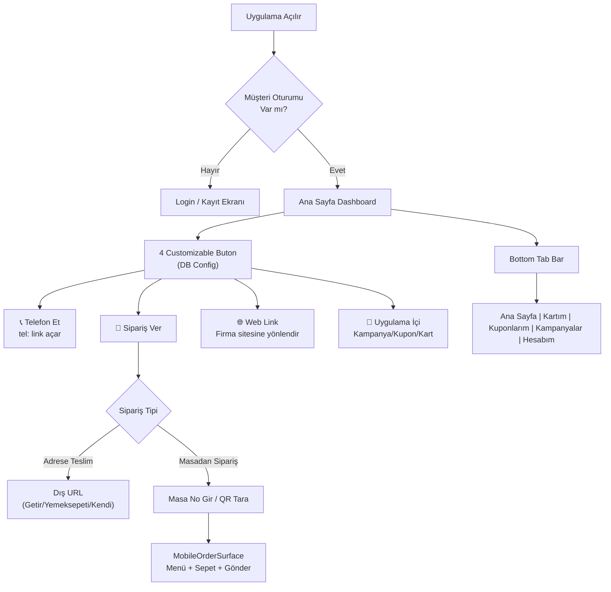

# Müşteri Mobil Uygulamasını Bağımsız Web App Olarak Yeniden Tasarlama

Mevcut `/musteri-app` yolundaki müşteri sadakat uygulamasını, telefon simülasyonu (phone shell frame) olmadan, gerçek bir mobil uygulama gibi çalışan bağımsız bir web app'e dönüştürmek. Samsung Galaxy A56 (6.7", 1080×2340, FHD+) boyutlarına optimize edilecek. Daha sonra APK olarak sarmalanacak.

> [!NOTE]
> **Kural Uyumu**: `.antigravityrules.md` ve `DESIGN_HANDBOOK_V3_TR.md` okundu. Tüm config verileri **Railway Postgres** tablosunda saklanacak (localStorage ile iş verisi yasak). Mobil app kendi tasarım dilini koruyacak (handbook madde 5.1: POS/Kiosk/Mobil ekranlar backoffice referansı olarak kullanılmaz). Admin config yüzeyi ise handbook kurallarına uygun olacak.

## User Review Required

> [!IMPORTANT]
> **Ana Sayfa 4 Buton Tasarımı**: Yüklediğiniz örnek görsellerden esinlenerek, ana sayfada 4 büyük aksiyonel buton olacak (2×2 grid). Bu butonlar admin panelinden **tamamen customize** edilebilecek. Her buton için:
> - **Tip seçimi**: "Telefon Et", "Sipariş Ver", "Web Link", "Uygulama İçi Sayfa" (kampanyalar, kuponlar, kartım, hesabım)
> - **Telefon numarası** (telefon et tipi için)
> - **URL** (web link / harici uygulama yönlendirmesi için)
> - **İkon** ve **etiket** değiştirilebilir
>
> Sipariş Ver butonu seçildiğinde: **"Adrese Teslim"** ve **"Masadan Sipariş"** ayrışması yapılacak. "Masadan Sipariş" seçildiğinde mevcut QR menü sipariş akışı (MobileOrderSurface) devreye girecek.

> [!IMPORTANT]
> **DB-First Config Yönetimi**: Branding ve buton konfigürasyonu `.antigravityrules.md` gereği **Railway Postgres'te** `customer_app_config` tablosunda saklanacak. `localStorage` ile config simülasyonu yapılmayacak.

## Open Questions

> [!IMPORTANT]
> **"Adrese Teslim" Sipariş Akışı**: "Sipariş Ver > Adrese Teslim" seçildiğinde, müşteri hangi uygulamaya/siteye yönlendirilecek? Bu bir dış link mi olacak (Getir, Yemeksepeti vb.) yoksa uygulama içinde adres girişli sipariş akışı mı istiyorsunuz? Şimdilik **dış link** olarak kurguluyorum, admin panelinden URL tanımlanabilecek.

> [!IMPORTANT]
> **Boss Ekranı**: Boss mobil uygulaması da aynı mantıkla mı dönüştürülecek, yoksa sadece müşteri uygulaması mı?

---

## Proposed Changes

### Veritabanı — Config Tablosu

#### [NEW] Migration: `customer_app_config` tablosu

```sql
CREATE TABLE IF NOT EXISTS customer_app_config (
  id UUID DEFAULT gen_random_uuid() PRIMARY KEY,
  config_key TEXT NOT NULL UNIQUE DEFAULT 'default',
  branding JSONB NOT NULL DEFAULT '{}',
  home_buttons JSONB NOT NULL DEFAULT '[]',
  active BOOLEAN NOT NULL DEFAULT TRUE,
  created_at TIMESTAMPTZ DEFAULT NOW(),
  updated_at TIMESTAMPTZ DEFAULT NOW(),
  deleted_at TIMESTAMPTZ
);
```

**branding** JSONB yapısı:
```json
{
  "companyName": "Rest Burger",
  "logoUrl": "",
  "backgroundImageUrl": "",
  "primaryColor": "#be185d",
  "headerGradient": ["#111827", "#312e81", "#f97316"],
  "welcomeText": "Hoş Geldiniz"
}
```

**home_buttons** JSONB yapısı (4 butonluk dizi):
```json
[
  {
    "id": "btn1",
    "type": "order",
    "label": "Sipariş Ver",
    "icon": "fa-utensils",
    "config": {
      "deliveryUrl": "https://getir.com/firma",
      "enableTableOrder": true
    }
  },
  {
    "id": "btn2",
    "type": "phone",
    "label": "Telefon Et",
    "icon": "fa-phone",
    "config": { "phoneNumber": "+905321234567" }
  },
  {
    "id": "btn3",
    "type": "weblink",
    "label": "Web Sitemiz",
    "icon": "fa-globe",
    "config": { "url": "https://firmam.com" }
  },
  {
    "id": "btn4",
    "type": "app_page",
    "label": "Kampanyalar",
    "icon": "fa-bullhorn",
    "config": { "pageKey": "campaigns" }
  }
]
```

---

### Lib Katmanı

#### [NEW] [customerMobileAppConfig.js](file:///c:/RMSggl/Dropbox/RMSv3/src/lib/customerMobileAppConfig.js)

Müşteri uygulamasının branding ve buton konfigürasyonunu DB'den okuyan/yazan yardımcı modül.

- `loadCustomerAppConfig()` — `customer_app_config` tablosundan `config_key='default'` satırını okur
- `saveCustomerAppConfig(config)` — upsert ile config'i günceller
- `getDefaultAppConfig()` — tablo boşsa/hata varsa kullanılacak fallback yapılandırma (örnek görsele benzer)
- Tüm DB işlemleri `import { db } from '@/lib/db'` üzerinden

---

### Müşteri Mobil App Bileşeni

#### [MODIFY] [CustomerLoyaltyMobileApp.jsx](file:///c:/RMSggl/Dropbox/RMSv3/src/components/mobile/CustomerLoyaltyMobileApp.jsx)

**Ana değişiklikler:**

1. **PhoneChrome bileşeni standalone modda tamamen kaldırılacak** — phone shell frame yerine tam ekran mobil uygulama viewport'u (`width: 100vw`, `min-height: 100svh`, `max-width: 430px`, safe-area-inset desteği)

2. **Yeni `MobileHomeDashboard` bileşeni** — Örnek görsel tarzında:
   - Üstte arka plan resmi + overlay + şirket logosu (config'den okunacak)
   - Hoş geldin banner'ı (müşteri adı + puan özeti)
   - 4 büyük customizable buton (2×2 grid, koyu kartlar, ikon + label)
   - Her buton tipi farklı aksiyon tetikler:
     - `phone` → `window.open('tel:...')`
     - `order` → Sipariş tipi seçim modalı açılır
     - `weblink` → `window.open(url, '_blank')`
     - `app_page` → İlgili tab'a geçiş

3. **Sipariş akışı entegrasyonu** — "Sipariş Ver" butonuna tıklandığında:
   - Modal açılacak: "Adrese Teslim" / "Masadan Sipariş" seçimi
   - "Masadan Sipariş" → Masa numarası girişi veya QR tarama → mevcut `MobileOrderSurface` akışı (MobileAppShells.jsx'teki mevcut QR menü altyapısı kullanılacak)
   - "Adrese Teslim" → Config'deki `deliveryUrl`'e yönlendirme

4. **Samsung A56 optimizasyonu** — CSS viewport: `width: 100vw`, `min-height: 100svh`, `max-width: 430px` (A56 CSS piksel genişliği ~412px), `env(safe-area-inset-*)` desteği

5. **Bottom tab bar** — Mevcut 5 tab korunacak (Ana Sayfa, Kartım, Kuponlarım, Kampanyalar, Hesabım), iOS/Android native görünüm

6. **Config entegrasyonu** — Uygulama açılışında `loadCustomerAppConfig()` ile DB'den branding/buton config okunacak, tek seferlik fetch (polling yok, kural 6'ya uygun)

---

### Admin Config Yüzeyi

#### [MODIFY] [MobileAppShells.jsx](file:///c:/RMSggl/Dropbox/RMSv3/src/components/pages/MobileAppShells.jsx)

- `screenKey="customer"` için: Phone shell frame içinde mevcut simülasyon korunacak (admin backoffice görünümü)
- Shell frame'in **üstüne** yeni bir **"Uygulama Ayarları"** bölümü eklenecek:
  - **Branding sekmesi**: Şirket adı, logo URL, arka plan resim URL, ana renk, gradient renkleri
  - **Butonlar sekmesi**: 4 butonun her biri için tip, label, ikon, config düzenleme
  - `Kaydet` butonu `saveCustomerAppConfig()` çağıracak
  - Design Handbook'a uygun: amber `#f5a623` birincil buton, modal/form standardı, Türkçe karakter kuralı

---

### Sayfa ve Route

#### [MODIFY] [CustomerMobileAppPage.jsx](file:///c:/RMSggl/Dropbox/RMSv3/src/components/pages/CustomerMobileAppPage.jsx)

- Standalone modda `<CustomerLoyaltyMobileApp mode="standalone" />` render etmeye devam edecek
- Ek olarak `useEffect` ile document'a PWA meta tag'ları inject edecek:
  - `<meta name="apple-mobile-web-app-capable" content="yes">`
  - `<meta name="theme-color" content="...">`
  - Viewport zaten mevcut ama `viewport-fit=cover` eklenecek

#### Değişiklik gerekmeyenler:
- [publicDisplayRoutes.js](file:///c:/RMSggl/Dropbox/RMSv3/src/lib/publicDisplayRoutes.js) — `/musteri-app` zaten tanımlı
- [App.jsx](file:///c:/RMSggl/Dropbox/RMSv3/src/App.jsx) — Route'lar mevcut

---

## Uygulama Mimarisi — Ana Sayfa Akışı



## Dosya Boyutu Etkisi

| Dosya | Tahmini Değişiklik |
|---|---|
| `CustomerLoyaltyMobileApp.jsx` | ~400 satır ekleme/düzenleme (yeni home dashboard, order flow modal) |
| `customerMobileAppConfig.js` | ~100 satır (yeni dosya, DB CRUD) |
| `MobileAppShells.jsx` | ~200 satır ekleme (config editor yüzeyi) |
| `CustomerMobileAppPage.jsx` | ~20 satır ekleme (PWA meta) |
| SQL migration | ~20 satır (customer_app_config tablosu) |

## Verification Plan

### Automated Tests
- `npm run dev` ile localhost'ta `/musteri-app` açılarak test
- Samsung A56 boyutlarında Chrome DevTools responsive modda kontrol (412×915 CSS px)
- Buton tipleri test: telefon et (tel: link), web link (window.open), uygulama içi sayfa geçişi
- Sipariş ver → masadan sipariş akışı: masa seçimi → ürün ekleme → gönder
- Admin config yüzeyi: branding değiştir → kaydet → `/musteri-app`'te kontrol

### Manual Verification
- Gerçek Samsung A56 telefondan `/musteri-app` URL'ine girerek native app deneyimi kontrolü
- PWA olarak "Ana Ekrana Ekle" testi
- `git status` ile dosyaların doğru konumda olduğunun teyidi (kural 5)
- `OperationSync.md`'ye tamamlanan işlerin loglanması (kural 4)
